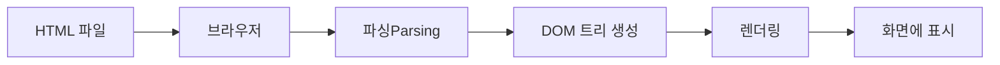

## 1. HTML이란?

**HTML(Hypertext Markup Language)**은 웹페이지를 만들기 위한 마크업 언어입니다.

### 1.1 HTML의 역할

- **구조(Structure)**: 웹페이지의 뼈대를 구성
- **콘텐츠(Content)**: 텍스트, 이미지, 비디오, 버튼 등을 표현
- **의미(Semantics)**: 콘텐츠의 의미를 정의

```html
<!DOCTYPE html>
<html lang="ko">
<head>
    <meta charset="UTF-8">
    <title>내 첫 웹페이지</title>
</head>
<body>
    <h1>안녕하세요!</h1>
    <p>HTML로 만든 웹페이지입니다.</p>
</body>
</html>
```

### 1.2 HTML의 특징

| 특징 | 설명 |
|------|------|
| **확장자** | `.html` 또는 `.htm` |
| **언어 타입** | 마크업 언어 (프로그래밍 언어 아님) |
| **구성 요소** | 태그(Tag)로 구성 |
| **표준** | W3C(World Wide Web Consortium) 관리 |
| **최신 버전** | HTML5 (2014년 표준화) |

> **Tip**: HTML은 "프로그래밍 언어"가 아닌 "마크업 언어"입니다. 로직을 처리하는 것이 아니라 콘텐츠의 구조와 의미를 정의합니다.
{: .prompt-tip }

## 2. 브라우저의 역할

### 2.1 브라우저란?

브라우저는 HTML 파일을 해석하여 사용자에게 웹페이지를 보여주는 프로그램입니다.

**주요 브라우저:**
- Google Chrome
- Mozilla Firefox
- Safari
- Microsoft Edge
- Opera

### 2.2 브라우저의 동작 과정



1. **HTML 파일 요청**: 사용자가 URL 입력
2. **파싱(Parsing)**: HTML 코드를 분석
3. **DOM 트리 생성**: 문서 객체 모델 구축
4. **렌더링(Rendering)**: 화면에 그리기
5. **표시**: 사용자에게 웹페이지 제공

### 2.3 HTML 파일 직접 열어보기

브라우저만 있으면 HTML 파일을 바로 확인할 수 있습니다.

```html
<!-- hello.html -->
<!DOCTYPE html>
<html lang="ko">
<head>
    <meta charset="UTF-8">
    <title>테스트</title>
</head>
<body>
    <h1>안녕하세요!</h1>
</body>
</html>
```

**확인 방법:**
1. 메모장(Windows) 또는 TextEdit(Mac)에서 위 코드 작성
2. `hello.html`로 저장
3. 파일을 브라우저에 드래그 앤 드롭
4. 웹페이지 확인!

## 3. HTML 태그(Tag)

### 3.1 태그의 기본 구조

HTML에서 모든 콘텐츠는 **태그(Tag)**로 감싸져 표현됩니다.

```html
<태그이름>내용</태그이름>
```

#### 태그 구조 상세

```html
<p>이것은 단락(paragraph)입니다.</p>
```

- **여는 태그(Opening Tag)**: `<p>`
- **내용(Content)**: `이것은 단락(paragraph)입니다.`
- **닫는 태그(Closing Tag)**: `</p>`

### 3.2 자체 닫힘 태그 (Self-Closing Tags)

일부 태그는 내용이 없어서 닫는 태그가 필요 없습니다.

```html
<!-- 이미지 -->


<!-- 줄바꿈 -->
<br>

<!-- 수평선 -->
<hr>

<!-- 입력 필드 -->
<input type="text">

<!-- 메타 정보 -->
<meta charset="UTF-8">
```

> **참고**: HTML5에서는 ``, `<br>` 등의 자체 닫힘 태그에 슬래시(`/`)를 붙이지 않아도 됩니다.
{: .prompt-info }

## 4. 요소(Element)와 속성(Attribute)

### 4.1 요소(Element)

**요소**는 시작 태그부터 끝 태그까지의 전체를 의미합니다.

```html
<h1>제목입니다</h1>  <!-- 하나의 요소 -->
```

#### 중첩 요소 (Nested Elements)

```html
<div>
    <h2>제목</h2>
    <p>단락입니다.</p>
    <ul>
        <li>항목 1</li>
        <li>항목 2</li>
    </ul>
</div>
```

### 4.2 속성(Attribute)

**속성**은 태그에 추가 정보를 제공합니다.

```html
<태그이름 속성="값">내용</태그이름>
```

#### 자주 사용하는 속성

| 속성 | 설명 | 예시 |
|------|------|------|
| **id** | 고유 식별자 | `<div id="header">` |
| **class** | 스타일 그룹 지정 | `<p class="intro">` |
| **src** | 이미지/스크립트 경로 | `` |
| **href** | 링크 주소 | `<a href="https://example.com">` |
| **alt** | 대체 텍스트 | `` |
| **style** | 인라인 스타일 | `<p style="color: red;">` |
| **title** | 툴팁 텍스트 | `<a title="자세히 보기">` |

#### 속성 사용 예시

```html
<!-- 여러 속성 함께 사용 -->


<!-- class는 여러 개 지정 가능 (공백으로 구분) -->
<div class="container main-content highlight">
    내용
</div>

<!-- data- 속성 (사용자 정의 데이터) -->
<button data-user-id="123" data-action="delete">
    삭제
</button>
```

## 5. 주요 HTML 태그

### 5.1 문서 구조 태그

```html
<!DOCTYPE html>           <!-- HTML5 문서 선언 -->
<html lang="ko">         <!-- 루트 요소 -->
<head>                   <!-- 메타 정보 -->
    <meta charset="UTF-8">
    <title>페이지 제목</title>
</head>
<body>                   <!-- 본문 -->
    <!-- 내용 -->
</body>
</html>
```

### 5.2 텍스트 관련 태그

```html
<!-- 제목 (Heading) -->
<h1>가장 큰 제목</h1>
<h2>두 번째 제목</h2>
<h3>세 번째 제목</h3>
<h4>네 번째 제목</h4>
<h5>다섯 번째 제목</h5>
<h6>가장 작은 제목</h6>

<!-- 단락 (Paragraph) -->
<p>이것은 단락입니다.</p>

<!-- 줄바꿈 -->
첫 번째 줄<br>
두 번째 줄

<!-- 강조 -->
<strong>굵게(중요)</strong>
<em>기울임(강조)</em>
<mark>하이라이트</mark>
```

### 5.3 링크와 이미지

```html
<!-- 링크 -->
<a href="https://example.com">외부 링크</a>
<a href="./about.html">내부 링크</a>
<a href="#section1">페이지 내 이동</a>
<a href="mailto:email@example.com">이메일 링크</a>

<!-- 이미지 -->


<!-- 이미지를 링크로 -->
<a href="https://example.com">
    
</a>
```

### 5.4 목록 태그

```html
<!-- 순서 없는 목록 (Unordered List) -->
<ul>
    <li>항목 1</li>
    <li>항목 2</li>
    <li>항목 3</li>
</ul>

<!-- 순서 있는 목록 (Ordered List) -->
<ol>
    <li>첫 번째</li>
    <li>두 번째</li>
    <li>세 번째</li>
</ol>

<!-- 설명 목록 (Description List) -->
<dl>
    <dt>HTML</dt>
    <dd>마크업 언어</dd>
    <dt>CSS</dt>
    <dd>스타일시트 언어</dd>
</dl>
```

### 5.5 컨테이너 태그

```html
<!-- 블록 레벨 컨테이너 -->
<div class="container">
    <p>내용</p>
</div>

<!-- 인라인 컨테이너 -->
<p>이것은 <span style="color: red;">빨간색</span> 텍스트입니다.</p>
```

### 5.6 시맨틱 태그 (HTML5)

```html
<header>헤더</header>
<nav>네비게이션</nav>
<main>
    <article>
        <h2>기사 제목</h2>
        <section>섹션 1</section>
        <section>섹션 2</section>
    </article>
    <aside>사이드바</aside>
</main>
<footer>푸터</footer>
```

## 6. 실전 예제

### 6.1 간단한 프로필 페이지

```html
<!DOCTYPE html>
<html lang="ko">
<head>
    <meta charset="UTF-8">
    <meta name="viewport" content="width=device-width, initial-scale=1.0">
    <title>내 프로필</title>
</head>
<body>
    <!-- 헤더 -->
    <header>
        <h1>김개발의 프로필</h1>
        <p>Frontend Developer</p>
    </header>

    <!-- 메인 콘텐츠 -->
    <main>
        <!-- 소개 섹션 -->
        <section>
            <h2>소개</h2>
            <p>안녕하세요! 웹 개발을 좋아하는 김개발입니다.</p>
            
        </section>

        <!-- 기술 스택 -->
        <section>
            <h2>기술 스택</h2>
            <ul>
                <li>HTML5</li>
                <li>CSS3</li>
                <li>JavaScript</li>
                <li>React</li>
            </ul>
        </section>

        <!-- 프로젝트 -->
        <section>
            <h2>프로젝트</h2>
            <article>
                <h3>프로젝트 1</h3>
                <p>쇼핑몰 웹사이트</p>
                <a href="https://github.com/example">GitHub 보기</a>
            </article>
            <article>
                <h3>프로젝트 2</h3>
                <p>날씨 앱</p>
                <a href="https://github.com/example">GitHub 보기</a>
            </article>
        </section>

        <!-- 연락처 -->
        <section>
            <h2>연락처</h2>
            <p>Email: <a href="mailto:dev@example.com">dev@example.com</a></p>
            <p>GitHub: <a href="https://github.com/example">github.com/example</a></p>
        </section>
    </main>

    <!-- 푸터 -->
    <footer>
        <p>&copy; 2024 김개발. All rights reserved.</p>
    </footer>
</body>
</html>
```

### 6.2 블로그 포스트 구조

```html
<!DOCTYPE html>
<html lang="ko">
<head>
    <meta charset="UTF-8">
    <title>블로그 포스트</title>
</head>
<body>
    <article>
        <!-- 포스트 헤더 -->
        <header>
            <h1>HTML 기초 배우기</h1>
            <p>
                <time datetime="2024-01-15">2024년 1월 15일</time>
                작성자: <strong>김개발</strong>
            </p>
        </header>

        <!-- 포스트 내용 -->
        <section>
            <h2>1. HTML이란?</h2>
            <p>HTML은 웹페이지를 만드는 언어입니다.</p>

            <h3>1.1 HTML의 역사</h3>
            <p>1991년 팀 버너스리가 개발했습니다.</p>
        </section>

        <section>
            <h2>2. 기본 태그</h2>
            <ul>
                <li><code>&lt;h1&gt;</code>: 제목</li>
                <li><code>&lt;p&gt;</code>: 단락</li>
                <li><code>&lt;a&gt;</code>: 링크</li>
            </ul>
        </section>

        <!-- 포스트 푸터 -->
        <footer>
            <p>태그: <a href="#html">HTML</a>, <a href="#web">Web</a></p>
        </footer>
    </article>
</body>
</html>
```

## 7. HTML 작성 Best Practices

### 7.1 올바른 구조 유지

```html
<!-- ✅ 좋은 예: 올바른 중첩 -->
<div>
    <p>단락입니다.</p>
</div>

<!-- ❌ 나쁜 예: 잘못된 중첩 -->
<div>
    <p>단락입니다.</div>
</p>
```

### 7.2 시맨틱 태그 사용

```html
<!-- ❌ 나쁜 예: div만 사용 -->
<div id="header">
    <div id="nav">...</div>
</div>
<div id="main">...</div>

<!-- ✅ 좋은 예: 시맨틱 태그 사용 -->
<header>
    <nav>...</nav>
</header>
<main>...</main>
```

### 7.3 속성값 따옴표 사용

```html
<!-- ✅ 좋은 예 -->


<!-- ❌ 나쁜 예 (작동하지만 비권장) -->

```

### 7.4 소문자 사용

```html
<!-- ✅ 좋은 예 -->
<div class="container">
    <p>내용</p>
</div>

<!-- ❌ 나쁜 예 (HTML5에서는 작동하지만 비권장) -->
<DIV CLASS="container">
    <P>내용</P>
</DIV>
```

### 7.5 alt 속성 항상 제공

```html
<!-- ✅ 좋은 예 -->


<!-- ❌ 나쁜 예 -->

```

## 8. 브라우저 개발자 도구 활용

### 8.1 개발자 도구 열기

- **Windows/Linux**: `F12` 또는 `Ctrl + Shift + I`
- **Mac**: `Cmd + Option + I`

### 8.2 HTML 구조 확인

개발자 도구의 **Elements** 탭에서:
- 실시간으로 HTML 구조 확인
- 요소 검사 및 수정
- CSS 스타일 확인

```html
<!-- 예시: 요소 검사 -->
<div class="container">
    <h1>제목</h1>
    <p>내용</p>
</div>
```

개발자 도구에서 위 요소를 선택하면 적용된 스타일과 Box Model을 확인할 수 있습니다.

## 정리

### HTML의 핵심 개념

1. **HTML은 마크업 언어** - 웹페이지의 구조를 정의
2. **브라우저가 해석** - HTML을 시각적으로 렌더링
3. **태그로 구성** - `<태그이름>내용</태그이름>` 형태
4. **요소(Element)** - 시작 태그부터 끝 태그까지
5. **속성(Attribute)** - 태그에 추가 정보 제공

### 시작하기 체크리스트

- [ ] HTML 파일 생성 (`.html` 확장자)
- [ ] 기본 구조 작성 (`<!DOCTYPE html>`, `<html>`, `<head>`, `<body>`)
- [ ] 시맨틱 태그 사용
- [ ] 올바른 속성 제공 (`alt`, `title` 등)
- [ ] 브라우저에서 테스트

> **참고**: HTML은 웹 개발의 시작점입니다. CSS와 JavaScript를 함께 학습하면 완전한 웹 페이지를 만들 수 있습니다.
{: .prompt-info }

## 다음 단계

1. **CSS 학습**: 웹페이지 스타일링
2. **JavaScript 학습**: 동적 기능 구현
3. **반응형 웹**: 다양한 기기 대응
4. **웹 접근성**: 모든 사용자를 위한 웹

## 참고 자료

- [MDN HTML 가이드](https://developer.mozilla.org/ko/docs/Web/HTML)
- [W3C HTML 표준](https://www.w3.org/TR/html52/)
- [HTML5 시맨틱 태그](https://developer.mozilla.org/ko/docs/Glossary/Semantics)
- [Can I Use](https://caniuse.com/) - 브라우저 호환성 확인
