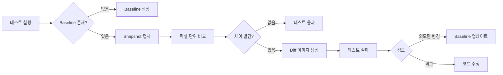

## 개요

시각적 회귀 테스트(Visual Regression Testing)는 UI의 시각적 변화를 자동으로 감지하여 의도하지 않은 스타일 변경을 방지하는 테스트 방법입니다. 이 가이드에서는 Percy, Chromatic, Playwright, BackstopJS 등 주요 도구를 활용한 실전 시각적 테스트 작성법을 다룹니다.

**이 글에서 배울 수 있는 것:**
- 시각적 회귀 테스트의 개념과 필요성
- 주요 도구(Percy, Chromatic, Playwright, BackstopJS) 비교 및 실습
- 반응형 디자인, 다크모드, 크로스 브라우저 테스트
- CI/CD 환경에서의 자동화
- False Positive 줄이기와 실무 Best Practices

**사전 요구사항:**
- JavaScript/TypeScript 기본 지식
- 웹 애플리케이션 개발 경험
- 테스트 코드 작성 경험 ([프론트엔드 테스팅 완벽 가이드](/posts/frontend-testing-guide/) 참고)
- E2E 테스트 개념 이해 ([E2E 테스트 실전 가이드](/posts/e2e-testing-guide/) 참고)

**예상 소요 시간:** 약 35분

---

## 목차

1. [시각적 회귀 테스트란?](#시각적-회귀-테스트란)
2. [왜 시각적 회귀 테스트가 필요한가?](#왜-시각적-회귀-테스트가-필요한가)
3. [작동 원리](#작동-원리)
4. [주요 도구 비교](#주요-도구-비교)
5. [Percy 실습](#percy-실습)
6. [Chromatic 실습](#chromatic-실습)
7. [Playwright 시각적 테스트](#playwright-시각적-테스트)
8. [BackstopJS 실습](#backstopjs-실습)
9. [실전 시나리오](#실전-시나리오)
10. [Best Practices](#best-practices)
11. [CI/CD 통합](#cicd-통합)
12. [자주 묻는 질문 (FAQ)](#자주-묻는-질문-faq)
13. [결론](#결론)
14. [참고 자료](#참고-자료)

---

## 시각적 회귀 테스트란?

### 정의

시각적 회귀 테스트는 웹 페이지의 **스크린샷을 캡처하고 기준 이미지(Baseline)와 비교**하여 시각적 차이를 감지하는 자동화 테스트입니다.

```jsx
// 일반 테스트 - 기능적 동작만 검증
test('버튼이 렌더링된다', () => {
  render(<Button>Click me</Button>);
  expect(screen.getByRole('button')).toBeInTheDocument();
  // ✅ 버튼이 존재하는지만 확인
  // ❌ 버튼의 색상, 크기, 위치는 검증하지 않음
});

// 시각적 회귀 테스트 - 시각적 외형까지 검증
test('버튼의 시각적 외형이 변하지 않았다', async () => {
  await page.goto('http://localhost:3000');
  await expect(page).toHaveScreenshot('button.png');
  // ✅ 버튼의 색상, 크기, 위치, 그림자 등 모든 시각적 요소 검증
});
```

### 핵심 개념

**1. Baseline (기준 이미지)**
- 정상적인 UI 상태를 나타내는 스크린샷
- 최초 테스트 실행 시 생성
- 이후 모든 비교의 기준이 됨

**2. Snapshot (현재 이미지)**
- 테스트 실행 시 캡처한 현재 UI 스크린샷
- Baseline과 비교 대상

**3. Diff (차이 이미지)**
- Baseline과 Snapshot의 차이를 시각화한 이미지
- 빨간색으로 변경된 픽셀을 표시

```bash
# 시각적 회귀 테스트 흐름
1. 최초 실행 → Baseline 이미지 생성
2. 이후 실행 → Snapshot 캡처 → Baseline과 비교
3. 차이 발견 → Diff 이미지 생성 → 테스트 실패
4. 검토 후 승인 → 새로운 Baseline으로 업데이트
```

---

## 왜 시각적 회귀 테스트가 필요한가?

### 기존 테스트의 한계

일반적인 단위 테스트나 통합 테스트는 **기능적 동작**은 검증하지만 **시각적 외형**은 검증하지 못합니다.

**시나리오: CSS 리팩토링 중 실수로 버튼 색상 변경**

```css
/* Before */
.button {
  background-color: #007bff; /* 파란색 */
}

/* After (실수로 변경됨) */
.button {
  background-color: #dc3545; /* 빨간색 */
}
```

```jsx
// 일반 테스트
test('버튼 클릭 시 카운트 증가', () => {
  render(<Counter />);
  fireEvent.click(screen.getByRole('button'));
  expect(screen.getByText('Count: 1')).toBeInTheDocument();
  // ✅ 통과 - 기능은 정상 동작
  // ❌ 버튼 색상 변경은 감지하지 못함
});

// 시각적 회귀 테스트
test('카운터 UI가 변하지 않았다', async () => {
  await expect(page).toHaveScreenshot();
  // ❌ 실패 - 버튼 색상 변경 감지
});
```

### 실제 사례

**케이스 1: CSS 우선순위 변경**
```css
/* 전역 스타일 추가로 특정 컴포넌트 레이아웃 깨짐 */
* {
  box-sizing: border-box; /* 추가됨 */
}

/* 기존 컴포넌트의 width 계산이 달라져 레이아웃 깨짐 */
.card {
  width: 300px;
  padding: 20px;
  /* box-sizing 변경으로 실제 너비가 300px → 340px로 증가 */
}
```

**케이스 2: 반응형 브레이크포인트 버그**
```css
/* 태블릿 뷰에서만 네비게이션 메뉴가 겹침 */
@media (max-width: 768px) {
  .nav-menu {
    position: absolute;
    /* z-index 누락으로 컨텐츠와 겹침 */
  }
}
```

**케이스 3: 다크모드 버그**
```javascript
// 라이트 모드에서만 테스트 → 다크모드 텍스트 가독성 문제 미발견
const Button = styled.button`
  background: white;
  color: white; /* 실수: 다크모드에서 흰 배경에 흰 글씨 */
`;
```

### 시각적 회귀 테스트의 이점

**1. 의도하지 않은 UI 변경 감지**
- CSS 리팩토링 중 발생하는 부작용 방지
- 글로벌 스타일 변경의 영향 범위 확인

**2. 디자인 일관성 유지**
- 컴포넌트 라이브러리의 시각적 일관성 보장
- 브랜드 가이드라인 준수 확인

**3. 크로스 브라우저 테스트**
- Safari, Chrome, Firefox에서 동일한 렌더링 보장
- 브라우저별 CSS 버그 조기 발견

**4. 반응형 디자인 검증**
- 모든 브레이크포인트에서 레이아웃 확인
- 모바일, 태블릿, 데스크톱 뷰 자동 테스트

**5. 문서화 효과**
- 스크린샷이 컴포넌트의 시각적 명세(Spec) 역할
- 디자이너-개발자 간 커뮤니케이션 도구

---

## 작동 원리

### 기본 흐름



### 픽셀 비교 알고리즘

대부분의 도구는 **Pixelmatch** 라이브러리를 사용하여 픽셀 단위로 이미지를 비교합니다.

```javascript
// Pixelmatch 알고리즘 동작 원리
function comparePixels(baseline, snapshot, options) {
  const { threshold = 0.1, maxDiffPixels } = options;

  let diffPixels = 0;

  // 각 픽셀의 RGBA 값 비교
  for (let i = 0; i < baseline.length; i += 4) {
    const r1 = baseline[i];
    const g1 = baseline[i + 1];
    const b1 = baseline[i + 2];
    const a1 = baseline[i + 3];

    const r2 = snapshot[i];
    const g2 = snapshot[i + 1];
    const b2 = snapshot[i + 2];
    const a2 = snapshot[i + 3];

    // 색상 차이 계산
    const delta = colorDelta(r1, g1, b1, a1, r2, g2, b2, a2);

    // threshold보다 큰 차이면 다른 픽셀로 판정
    if (delta > threshold) {
      diffPixels++;
    }
  }

  // 허용 가능한 차이 픽셀 수를 초과하면 실패
  return diffPixels <= maxDiffPixels;
}
```

### 비교 옵션

**1. Threshold (임계값)**
```javascript
// 0.0 (완전히 동일) ~ 1.0 (완전히 다름)
await expect(page).toHaveScreenshot({
  threshold: 0.1, // 10% 이하의 색상 차이는 무시
});
```

**2. Max Diff Pixels (최대 차이 픽셀 수)**
```javascript
await expect(page).toHaveScreenshot({
  maxDiffPixels: 100, // 100px 이하 차이는 허용
});
```

**3. Ignore Regions (무시 영역)**
```javascript
await expect(page).toHaveScreenshot({
  mask: [page.locator('.timestamp')], // 동적 컨텐츠 영역 마스킹
});
```

---

## 주요 도구 비교

| 특징 | Percy | Chromatic | Playwright | BackstopJS |
|------|-------|-----------|------------|------------|
| **타입** | SaaS (클라우드) | SaaS (클라우드) | 오픈소스 (로컬) | 오픈소스 (로컬) |
| **가격** | 무료: 5,000 스냅샷/월<br>유료: $449~/월 | 무료: 5,000 스냅샷/월<br>유료: $149~/월 | 무료 | 무료 |
| **주요 용도** | 모든 웹 앱 | Storybook 중심 | E2E 테스트에 통합 | 독립적인 VRT |
| **브라우저** | Chrome, Firefox, Edge, Safari | Chrome, Firefox, Safari, Edge | Chromium, Firefox, WebKit | Chrome, Firefox |
| **병렬 실행** | ✅ 클라우드에서 자동 | ✅ 클라우드에서 자동 | ✅ 로컬 또는 CI | ✅ 설정 필요 |
| **Responsive** | ✅ 다중 뷰포트 | ✅ 다중 뷰포트 | ✅ 다중 뷰포트 | ✅ 다중 뷰포트 |
| **AI 기반** | ✅ 노이즈 제거 | ✅ 스마트 비교 | ❌ | ❌ |
| **CI 통합** | ✅ GitHub, GitLab, etc | ✅ GitHub, GitLab, etc | ✅ 모든 CI | ✅ 모든 CI |
| **리뷰 UI** | ✅ 웹 대시보드 | ✅ 웹 대시보드 | ❌ HTML 리포트 | ❌ HTML 리포트 |
| **Storybook** | ✅ 플러그인 | ✅ 네이티브 지원 | ⚠️ 수동 통합 | ⚠️ 수동 통합 |
| **학습 곡선** | 쉬움 | 쉬움 | 중간 | 중간 |
| **설정 복잡도** | 낮음 | 낮음 | 중간 | 높음 |

### 도구 선택 가이드

```javascript
// Chromatic을 선택하는 경우
if (useStorybook && focusOnComponents && needCollaboration) {
  return 'Chromatic';
}

// Percy를 선택하는 경우
if (multiFramework && needCrossBrowser && haveBudget) {
  return 'Percy';
}

// Playwright를 선택하는 경우
if (alreadyUsePlaywright && needE2EIntegration && wantOpenSource) {
  return 'Playwright Visual Testing';
}

// BackstopJS를 선택하는 경우
if (needFullControl && wantOpenSource && haveTechnicalSkills) {
  return 'BackstopJS';
}
```

**추천 시나리오:**

- **Storybook 기반 컴포넌트 라이브러리** → Chromatic
- **다양한 프레임워크, 크로스 브라우저 중요** → Percy
- **E2E 테스트에 시각적 테스트 추가** → Playwright
- **완전한 커스터마이징, 비용 제로** → BackstopJS

---

## Percy 실습

### 설치 및 설정

```bash
# Percy CLI 설치
npm install --save-dev @percy/cli @percy/playwright

# Playwright 프로젝트가 없다면
npm init playwright@latest
```

### Percy 프로젝트 생성

1. [percy.io](https://percy.io)에서 계정 생성
2. 새 프로젝트 생성
3. `PERCY_TOKEN` 받기

```bash
# 환경 변수 설정
export PERCY_TOKEN=your_token_here
```

### 기본 테스트 작성

```javascript
// tests/visual.spec.js
import { test } from '@playwright/test';
import percySnapshot from '@percy/playwright';

test.describe('시각적 회귀 테스트', () => {
  test('홈페이지 렌더링', async ({ page }) => {
    await page.goto('http://localhost:3000');

    // Percy 스냅샷 캡처
    await percySnapshot(page, 'Homepage');
  });

  test('로그인 폼 렌더링', async ({ page }) => {
    await page.goto('http://localhost:3000/login');

    // 특정 옵션과 함께 스냅샷
    await percySnapshot(page, 'Login Form', {
      widths: [375, 768, 1280], // 반응형 테스트
      minHeight: 1024,
    });
  });

  test('버튼 호버 상태', async ({ page }) => {
    await page.goto('http://localhost:3000');

    // 호버 상태 스냅샷
    await page.hover('button.primary');
    await percySnapshot(page, 'Button Hover State');
  });
});
```

### 다중 뷰포트 테스트

```javascript
// tests/responsive.spec.js
test('반응형 디자인 테스트', async ({ page }) => {
  await page.goto('http://localhost:3000');

  // 여러 뷰포트에서 동시에 캡처
  await percySnapshot(page, 'Responsive Design', {
    widths: [375, 768, 1024, 1280, 1920], // Mobile, Tablet, Desktop
    minHeight: 1024,
  });
});
```

### 동적 컨텐츠 처리

```javascript
test('동적 컨텐츠 무시', async ({ page }) => {
  await page.goto('http://localhost:3000/dashboard');

  // 타임스탬프, 애니메이션 등 동적 요소 무시
  await percySnapshot(page, 'Dashboard', {
    percyCSS: `
      .timestamp { visibility: hidden; }
      .loading-spinner { display: none; }
      * { animation: none !important; }
    `
  });
});
```

### 실행

```bash
# Percy와 함께 Playwright 실행
npx percy exec -- npx playwright test

# 결과는 Percy 대시보드에서 확인
# https://percy.io/your-org/your-project
```

### Percy 대시보드에서 리뷰

```bash
# 1. 웹 대시보드에서 변경사항 확인
# 2. Diff 이미지 검토
# 3. 승인 또는 거부
#    - Approve: 새로운 Baseline으로 업데이트
#    - Reject: 버그로 판정, 코드 수정 필요
```

### CI/CD 통합 (GitHub Actions)

```yaml
# .github/workflows/visual-tests.yml
name: Visual Tests

on: [push, pull_request]

jobs:
  visual-test:
    runs-on: ubuntu-latest
    steps:
      - uses: actions/checkout@v3

      - name: Setup Node
        uses: actions/setup-node@v3
        with:
          node-version: '18'

      - name: Install dependencies
        run: npm ci

      - name: Install Playwright browsers
        run: npx playwright install --with-deps

      - name: Start dev server
        run: npm run dev &

      - name: Wait for server
        run: npx wait-on http://localhost:3000

      - name: Run Percy visual tests
        run: npx percy exec -- npx playwright test
        env:
          PERCY_TOKEN: ${{ secrets.PERCY_TOKEN }}
```

---

## Chromatic 실습

Chromatic은 **Storybook 제작팀이 만든 도구**로, Storybook과의 네이티브 통합을 제공합니다.

### 설치 및 설정

```bash
# Storybook이 없다면 설치
npx storybook@latest init

# Chromatic CLI 설치
npm install --save-dev chromatic
```

### Chromatic 프로젝트 생성

```bash
# Chromatic 프로젝트 생성 및 첫 배포
npx chromatic --project-token=your_token_here

# 토큰은 .env에 저장
echo "CHROMATIC_PROJECT_TOKEN=your_token" >> .env
```

### Storybook Stories 작성

```jsx
// src/components/Button.stories.jsx
import Button from './Button';

export default {
  title: 'Components/Button',
  component: Button,
  parameters: {
    // Chromatic에서 이 스토리를 스냅샷
    chromatic: {
      viewports: [375, 768, 1280], // 반응형 테스트
    },
  },
};

// 기본 버튼
export const Primary = {
  args: {
    variant: 'primary',
    children: 'Click me',
  },
};

// 호버 상태
export const PrimaryHover = {
  args: {
    variant: 'primary',
    children: 'Click me',
  },
  parameters: {
    pseudo: { hover: true }, // 호버 상태 시뮬레이션
  },
};

// 포커스 상태
export const PrimaryFocus = {
  args: {
    variant: 'primary',
    children: 'Click me',
  },
  parameters: {
    pseudo: { focus: true },
  },
};

// Disabled 상태
export const Disabled = {
  args: {
    variant: 'primary',
    children: 'Click me',
    disabled: true,
  },
};

// 다크모드
export const DarkMode = {
  args: {
    variant: 'primary',
    children: 'Click me',
  },
  parameters: {
    backgrounds: { default: 'dark' },
  },
  decorators: [
    (Story) => (
      <div className="dark">
        <Story />
      </div>
    ),
  ],
};
```

### 복잡한 컴포넌트 테스트

```javascript
// src/components/Card.stories.jsx
export default {
  title: 'Components/Card',
  component: Card,
};

// 로딩 상태
export const Loading = {
  args: {
    isLoading: true,
  },
};

// 데이터 로드 완료
export const WithData = {
  args: {
    title: 'Product Name',
    description: 'Product description here',
    price: '$99.99',
    image: 'https://via.placeholder.com/300',
  },
};

// 에러 상태
export const Error = {
  args: {
    error: 'Failed to load data',
  },
};

// 긴 텍스트 처리
export const LongContent = {
  args: {
    title: 'Very Long Product Name That Might Break Layout',
    description: 'Lorem ipsum dolor sit amet '.repeat(20),
  },
};
```

### 동적 컨텐츠 처리

```javascript
// .storybook/preview.js
export const parameters = {
  chromatic: {
    // 모든 애니메이션 비활성화
    disableSnapshot: false,
    pauseAnimationAtEnd: true,

    // 딜레이 추가 (폰트 로딩 대기)
    delay: 300,
  },
};

// 특정 스토리에서만 애니메이션 무시
export const AnimatedComponent = {
  parameters: {
    chromatic: {
      pauseAnimationAtEnd: true,
    },
  },
};
```

### 특정 요소 무시

```javascript
export const Dashboard = {
  parameters: {
    chromatic: {
      // CSS로 동적 요소 숨기기
      ignoreSelectors: [
        '.timestamp',
        '.live-update',
        '.random-content',
      ],
    },
  },
};
```

### 실행

```bash
# 로컬 Storybook 실행 (확인용)
npm run storybook

# Chromatic에 빌드 배포 및 시각적 테스트
npx chromatic --project-token=$CHROMATIC_PROJECT_TOKEN

# 특정 브랜치만 테스트
npx chromatic --branch-name=feature/new-design

# 자동 승인 (CI에서 main 브랜치)
npx chromatic --auto-accept-changes="main"
```

### CI/CD 통합 (GitHub Actions)

```yaml
# .github/workflows/chromatic.yml
name: Chromatic

on:
  push:
    branches: [main, develop]
  pull_request:

jobs:
  chromatic:
    runs-on: ubuntu-latest
    steps:
      - uses: actions/checkout@v3
        with:
          fetch-depth: 0 # Chromatic이 git history 필요

      - name: Setup Node
        uses: actions/setup-node@v3
        with:
          node-version: '18'

      - name: Install dependencies
        run: npm ci

      - name: Run Chromatic
        uses: chromaui/action@v1
        with:
          projectToken: ${{ secrets.CHROMATIC_PROJECT_TOKEN }}
          token: ${{ secrets.GITHUB_TOKEN }}
          # main 브랜치는 자동 승인
          autoAcceptChanges: main
```

### Chromatic 대시보드 활용

```javascript
// PR에서 Chromatic 결과 확인
// 1. Chromatic bot이 자동으로 PR에 코멘트 추가
// 2. "View in Chromatic" 링크 클릭
// 3. Before/After 비교
// 4. Accept or Deny 결정
// 5. 모든 변경 승인 시 PR 머지 가능
```

---

## Playwright 시각적 테스트

Playwright는 v1.20부터 네이티브 시각적 테스트 기능을 제공합니다.

### 기본 설정

```javascript
// playwright.config.js
import { defineConfig } from '@playwright/test';

export default defineConfig({
  testDir: './tests',

  // 시각적 테스트 설정
  expect: {
    toHaveScreenshot: {
      // 픽셀 차이 허용 임계값 (0.0 ~ 1.0)
      threshold: 0.2,

      // 최대 허용 픽셀 차이 수
      maxDiffPixels: 100,

      // 애니메이션 완료 대기
      animations: 'disabled',

      // CSS transition 비활성화
      caret: 'hide',
    },
  },

  use: {
    // 기본 뷰포트
    viewport: { width: 1280, height: 720 },

    // 스크린샷 전체 페이지
    screenshot: 'only-on-failure',
  },

  projects: [
    {
      name: 'chromium',
      use: { browserName: 'chromium' },
    },
    {
      name: 'firefox',
      use: { browserName: 'firefox' },
    },
    {
      name: 'webkit',
      use: { browserName: 'webkit' },
    },
  ],
});
```

### 페이지 스크린샷

```javascript
// tests/visual.spec.js
import { test, expect } from '@playwright/test';

test('홈페이지 전체 스크린샷', async ({ page }) => {
  await page.goto('http://localhost:3000');

  // 전체 페이지 스크린샷
  await expect(page).toHaveScreenshot('homepage.png');

  // 최초 실행: 기준 이미지 생성
  // 이후 실행: 기준 이미지와 비교
});

test('특정 뷰포트 크기', async ({ page }) => {
  // 모바일 뷰포트
  await page.setViewportSize({ width: 375, height: 667 });
  await page.goto('http://localhost:3000');
  await expect(page).toHaveScreenshot('homepage-mobile.png');
});
```

### 요소 스크린샷

```javascript
test('버튼 컴포넌트만 캡처', async ({ page }) => {
  await page.goto('http://localhost:3000');

  const button = page.locator('button.primary');

  // 특정 요소만 스크린샷
  await expect(button).toHaveScreenshot('primary-button.png');
});

test('여러 상태의 버튼', async ({ page }) => {
  await page.goto('http://localhost:3000');
  const button = page.locator('button.primary');

  // 기본 상태
  await expect(button).toHaveScreenshot('button-default.png');

  // 호버 상태
  await button.hover();
  await expect(button).toHaveScreenshot('button-hover.png');

  // 포커스 상태
  await button.focus();
  await expect(button).toHaveScreenshot('button-focus.png');

  // Active 상태 (클릭 중)
  await button.dispatchEvent('mousedown');
  await expect(button).toHaveScreenshot('button-active.png');
});
```

### 동적 컨텐츠 마스킹

```javascript
test('동적 컨텐츠 영역 마스킹', async ({ page }) => {
  await page.goto('http://localhost:3000/dashboard');

  await expect(page).toHaveScreenshot('dashboard.png', {
    // 특정 영역 마스킹 (검은 박스로 가려짐)
    mask: [
      page.locator('.timestamp'),
      page.locator('.live-data'),
      page.locator('.user-avatar'), // 사용자마다 다른 이미지
    ],
  });
});
```

### 특정 영역만 비교

```javascript
test('특정 영역만 스크린샷', async ({ page }) => {
  await page.goto('http://localhost:3000');

  // 헤더만 비교
  const header = page.locator('header');
  await expect(header).toHaveScreenshot('header.png');

  // 메인 컨텐츠만 비교
  const main = page.locator('main');
  await expect(main).toHaveScreenshot('main-content.png');
});
```

### 임계값 조정

```javascript
test('약간의 차이 허용', async ({ page }) => {
  await page.goto('http://localhost:3000');

  await expect(page).toHaveScreenshot('homepage.png', {
    // 최대 5%의 픽셀 차이 허용
    threshold: 0.05,

    // 또는 최대 200픽셀 차이 허용
    maxDiffPixels: 200,
  });
});
```

### 여러 브라우저에서 테스트

```javascript
// playwright.config.js
export default defineConfig({
  projects: [
    {
      name: 'Desktop Chrome',
      use: {
        browserName: 'chromium',
        viewport: { width: 1920, height: 1080 },
      },
    },
    {
      name: 'Desktop Firefox',
      use: {
        browserName: 'firefox',
        viewport: { width: 1920, height: 1080 },
      },
    },
    {
      name: 'Desktop Safari',
      use: {
        browserName: 'webkit',
        viewport: { width: 1920, height: 1080 },
      },
    },
    {
      name: 'Mobile Chrome',
      use: {
        browserName: 'chromium',
        viewport: { width: 375, height: 667 },
        isMobile: true,
      },
    },
  ],
});
```

### 실행 및 업데이트

```bash
# 시각적 테스트 실행
npx playwright test

# 실패 시 diff 이미지 확인
# tests/visual.spec.js-snapshots/homepage-diff.png

# HTML 리포트로 확인
npx playwright show-report

# 의도된 변경인 경우 Baseline 업데이트
npx playwright test --update-snapshots

# 특정 테스트만 업데이트
npx playwright test visual.spec.js --update-snapshots
```

### 디버깅

```javascript
test('스크린샷 디버깅', async ({ page }) => {
  await page.goto('http://localhost:3000');

  // 1. 페이지가 완전히 로드될 때까지 대기
  await page.waitForLoadState('networkidle');

  // 2. 특정 요소가 보일 때까지 대기
  await page.waitForSelector('.content', { state: 'visible' });

  // 3. 폰트 로딩 대기
  await page.waitForFunction(() => document.fonts.ready);

  // 4. 커스텀 딜레이
  await page.waitForTimeout(1000);

  // 5. 스크린샷
  await expect(page).toHaveScreenshot();
});
```

---

## BackstopJS 실습

BackstopJS는 완전히 오픈소스이며 로컬에서 실행되는 시각적 회귀 테스트 도구입니다.

### 설치 및 초기화

```bash
# BackstopJS 설치
npm install --save-dev backstopjs

# 초기화 (backstop.json 생성)
npx backstop init
```

### 설정 파일

```javascript
// backstop.json
{
  "id": "my_project",
  "viewports": [
    {
      "label": "phone",
      "width": 375,
      "height": 667
    },
    {
      "label": "tablet",
      "width": 768,
      "height": 1024
    },
    {
      "label": "desktop",
      "width": 1920,
      "height": 1080
    }
  ],
  "scenarios": [
    {
      "label": "Homepage",
      "url": "http://localhost:3000",
      "referenceUrl": "",
      "readyEvent": "",
      "readySelector": "",
      "delay": 1000,
      "hideSelectors": [],
      "removeSelectors": [],
      "hoverSelector": "",
      "clickSelector": "",
      "postInteractionWait": 0,
      "selectors": ["document"],
      "selectorExpansion": true,
      "expect": 0,
      "misMatchThreshold": 0.1,
      "requireSameDimensions": true
    }
  ],
  "paths": {
    "bitmaps_reference": "backstop_data/bitmaps_reference",
    "bitmaps_test": "backstop_data/bitmaps_test",
    "engine_scripts": "backstop_data/engine_scripts",
    "html_report": "backstop_data/html_report",
    "ci_report": "backstop_data/ci_report"
  },
  "report": ["browser"],
  "engine": "puppeteer",
  "engineOptions": {
    "args": ["--no-sandbox"]
  },
  "asyncCaptureLimit": 5,
  "asyncCompareLimit": 50,
  "debug": false,
  "debugWindow": false
}
```

### 시나리오 작성

```javascript
// backstop.json
{
  "scenarios": [
    // 기본 페이지
    {
      "label": "Homepage",
      "url": "http://localhost:3000",
      "delay": 500,
      "misMatchThreshold": 0.1
    },

    // 특정 요소만 캡처
    {
      "label": "Navigation Menu",
      "url": "http://localhost:3000",
      "selectors": ["nav.main-menu"],
      "delay": 500
    },

    // 호버 상태
    {
      "label": "Button Hover",
      "url": "http://localhost:3000",
      "hoverSelector": "button.primary",
      "postInteractionWait": 200,
      "selectors": ["button.primary"]
    },

    // 클릭 인터랙션
    {
      "label": "Dropdown Menu Open",
      "url": "http://localhost:3000",
      "clickSelector": ".dropdown-trigger",
      "postInteractionWait": 300,
      "selectors": [".dropdown-menu"]
    },

    // 동적 컨텐츠 숨기기
    {
      "label": "Dashboard",
      "url": "http://localhost:3000/dashboard",
      "hideSelectors": [
        ".timestamp",
        ".live-data"
      ],
      "delay": 1000
    },

    // 쿠키 설정 (로그인 상태)
    {
      "label": "User Profile (Logged in)",
      "url": "http://localhost:3000/profile",
      "cookiePath": "backstop_data/engine_scripts/cookies.json",
      "delay": 500
    }
  ]
}
```

### 커스텀 스크립트

```javascript
// backstop_data/engine_scripts/onReady.js
module.exports = async (page, scenario, viewport, isReference) => {
  console.log('Scenario: ' + scenario.label);

  // 폰트 로딩 대기
  await page.evaluateHandle('document.fonts.ready');

  // 애니메이션 비활성화
  await page.evaluate(() => {
    const style = document.createElement('style');
    style.innerHTML = `
      * {
        animation-duration: 0s !important;
        transition-duration: 0s !important;
      }
    `;
    document.head.appendChild(style);
  });

  // 스크롤 완료 대기
  await page.evaluate(() => window.scrollTo(0, 0));

  // 딜레이
  await new Promise(resolve => setTimeout(resolve, 500));
};
```

```javascript
// backstop_data/engine_scripts/onBefore.js
module.exports = async (page, scenario, viewport) => {
  // 쿠키 설정 (로그인 시뮬레이션)
  await page.setCookie({
    name: 'session',
    value: 'test-session-token',
    domain: 'localhost',
  });
};
```

### 실행

```bash
# 1. 기준 이미지 생성
npx backstop reference

# 2. 테스트 실행 (기준 이미지와 비교)
npx backstop test

# 3. 리포트 자동 열림 (브라우저)
# 실패 시 diff 이미지 확인 가능

# 4. 의도된 변경인 경우 승인
npx backstop approve

# 5. 특정 시나리오만 테스트
npx backstop test --filter="Homepage"
```

### Docker로 실행 (일관성 보장)

```dockerfile
# Dockerfile
FROM backstopjs/backstopjs:latest

WORKDIR /src

COPY package*.json ./
RUN npm ci

COPY . .

CMD ["test"]
```

```yaml
# docker-compose.yml
version: '3'
services:
  backstop:
    build: .
    volumes:
      - ./backstop_data:/src/backstop_data
    command: backstop test
```

```bash
# Docker로 실행
docker-compose run backstop
```

### CI/CD 통합 (GitHub Actions)

```yaml
# .github/workflows/visual-tests.yml
name: Visual Regression Tests

on: [push, pull_request]

jobs:
  backstop:
    runs-on: ubuntu-latest
    steps:
      - uses: actions/checkout@v3

      - name: Setup Node
        uses: actions/setup-node@v3
        with:
          node-version: '18'

      - name: Install dependencies
        run: npm ci

      - name: Start dev server
        run: |
          npm run dev &
          npx wait-on http://localhost:3000

      - name: Run BackstopJS
        run: npx backstop test --config=backstop.json

      - name: Upload diff images
        if: failure()
        uses: actions/upload-artifact@v3
        with:
          name: backstop-diff
          path: backstop_data/bitmaps_test/**/*diff.png
```

---

## 실전 시나리오

### 1. 반응형 디자인 테스트

**시나리오:** 모든 브레이크포인트에서 레이아웃이 깨지지 않는지 확인

```javascript
// Playwright
const viewports = [
  { name: 'mobile', width: 375, height: 667 },
  { name: 'tablet', width: 768, height: 1024 },
  { name: 'desktop', width: 1920, height: 1080 },
  { name: 'ultrawide', width: 2560, height: 1440 },
];

for (const viewport of viewports) {
  test(`반응형 테스트 - ${viewport.name}`, async ({ page }) => {
    await page.setViewportSize(viewport);
    await page.goto('http://localhost:3000');

    await expect(page).toHaveScreenshot(`homepage-${viewport.name}.png`);
  });
}
```

```javascript
// Percy
test('반응형 디자인 테스트', async ({ page }) => {
  await page.goto('http://localhost:3000');

  await percySnapshot(page, 'Responsive Homepage', {
    widths: [375, 768, 1024, 1280, 1920],
  });
});
```

**브레이크포인트별 중요 체크 포인트:**

```javascript
test('브레이크포인트별 주요 요소', async ({ page }) => {
  const breakpoints = {
    mobile: { width: 375, checks: ['햄버거 메뉴', '모바일 네비게이션'] },
    tablet: { width: 768, checks: ['태블릿 그리드', '2열 레이아웃'] },
    desktop: { width: 1280, checks: ['데스크톱 네비게이션', '3열 레이아웃'] },
  };

  for (const [device, config] of Object.entries(breakpoints)) {
    await page.setViewportSize({ width: config.width, height: 1024 });
    await page.goto('http://localhost:3000');

    // 각 디바이스별 중요 요소 스크린샷
    for (const element of config.checks) {
      const selector = `.${element.replace(/\s+/g, '-').toLowerCase()}`;
      await expect(page.locator(selector)).toHaveScreenshot(
        `${device}-${element}.png`
      );
    }
  }
});
```

### 2. 다크모드 전환 테스트

**시나리오:** 라이트/다크 모드 전환 시 모든 컴포넌트가 올바르게 렌더링

```javascript
// Playwright
test.describe('다크모드 테스트', () => {
  test('라이트 모드', async ({ page }) => {
    await page.goto('http://localhost:3000');

    // 라이트 모드 설정
    await page.evaluate(() => {
      localStorage.setItem('theme', 'light');
      document.documentElement.classList.remove('dark');
    });

    await page.reload();
    await expect(page).toHaveScreenshot('light-mode.png');
  });

  test('다크 모드', async ({ page }) => {
    await page.goto('http://localhost:3000');

    // 다크 모드 설정
    await page.evaluate(() => {
      localStorage.setItem('theme', 'dark');
      document.documentElement.classList.add('dark');
    });

    await page.reload();
    await expect(page).toHaveScreenshot('dark-mode.png');
  });

  test('다크모드 전환 애니메이션', async ({ page }) => {
    await page.goto('http://localhost:3000');

    // 라이트 모드 스크린샷
    await expect(page).toHaveScreenshot('before-toggle.png');

    // 토글 버튼 클릭
    await page.click('[aria-label="Toggle theme"]');

    // 전환 완료 대기
    await page.waitForTimeout(500);

    // 다크 모드 스크린샷
    await expect(page).toHaveScreenshot('after-toggle.png');
  });
});
```

```jsx
// Storybook + Chromatic
export const LightMode = {
  parameters: {
    backgrounds: { default: 'light' },
  },
};

export const DarkMode = {
  parameters: {
    backgrounds: { default: 'dark' },
  },
  decorators: [
    (Story) => (
      <div className="dark">
        <Story />
      </div>
    ),
  ],
};
```

### 3. 크로스 브라우저 테스트

**시나리오:** Chrome, Firefox, Safari에서 동일하게 렌더링

```javascript
// playwright.config.js
export default defineConfig({
  projects: [
    {
      name: 'Chrome',
      use: {
        browserName: 'chromium',
        channel: 'chrome',
      },
    },
    {
      name: 'Firefox',
      use: {
        browserName: 'firefox',
      },
    },
    {
      name: 'Safari',
      use: {
        browserName: 'webkit',
      },
    },
    {
      name: 'Edge',
      use: {
        browserName: 'chromium',
        channel: 'msedge',
      },
    },
  ],
});

// tests/cross-browser.spec.js
test('크로스 브라우저 렌더링', async ({ page, browserName }) => {
  await page.goto('http://localhost:3000');

  // 브라우저별로 다른 baseline
  await expect(page).toHaveScreenshot(`homepage-${browserName}.png`);
});
```

**브라우저별 주의사항:**

```javascript
test('브라우저 특정 스타일 테스트', async ({ page, browserName }) => {
  await page.goto('http://localhost:3000');

  if (browserName === 'webkit') {
    // Safari는 폰트 렌더링이 다름
    await expect(page).toHaveScreenshot('safari.png', {
      threshold: 0.3, // 더 관대한 임계값
    });
  } else {
    await expect(page).toHaveScreenshot('standard.png');
  }
});
```

### 4. CSS 변경 감지

**시나리오:** 글로벌 CSS 변경이 다른 페이지에 영향을 주는지 확인

```javascript
// 모든 주요 페이지 테스트
const pages = [
  '/',
  '/about',
  '/products',
  '/contact',
  '/dashboard',
];

for (const path of pages) {
  test(`CSS 변경 영향 확인 - ${path}`, async ({ page }) => {
    await page.goto(`http://localhost:3000${path}`);
    await expect(page).toHaveScreenshot(`page-${path.replace('/', '')}.png`);
  });
}
```

### 5. 컴포넌트 단위 시각적 테스트

**시나리오:** 디자인 시스템의 모든 컴포넌트 상태 테스트

```javascript
// Button 컴포넌트의 모든 변형
const buttonVariants = {
  variants: ['primary', 'secondary', 'outline', 'ghost'],
  sizes: ['sm', 'md', 'lg'],
  states: ['default', 'hover', 'focus', 'active', 'disabled'],
};

test.describe('Button 컴포넌트 시각적 테스트', () => {
  for (const variant of buttonVariants.variants) {
    for (const size of buttonVariants.sizes) {
      for (const state of buttonVariants.states) {
        test(`${variant}-${size}-${state}`, async ({ page }) => {
          await page.goto(`http://localhost:6006/?path=/story/button--${variant}`);

          const button = page.locator(`button[data-size="${size}"]`);

          // 상태 적용
          if (state === 'hover') {
            await button.hover();
          } else if (state === 'focus') {
            await button.focus();
          } else if (state === 'disabled') {
            await button.evaluate(btn => btn.disabled = true);
          }

          await expect(button).toHaveScreenshot(
            `button-${variant}-${size}-${state}.png`
          );
        });
      }
    }
  }
});
```

### 6. 폼 상태 테스트

```javascript
test.describe('폼 시각적 상태', () => {
  test('빈 폼', async ({ page }) => {
    await page.goto('http://localhost:3000/form');
    await expect(page).toHaveScreenshot('form-empty.png');
  });

  test('입력 중인 폼', async ({ page }) => {
    await page.goto('http://localhost:3000/form');

    await page.fill('input[name="email"]', 'test@example.com');
    await page.fill('input[name="password"]', 'password123');

    await expect(page).toHaveScreenshot('form-filled.png');
  });

  test('유효성 검증 에러', async ({ page }) => {
    await page.goto('http://localhost:3000/form');

    await page.fill('input[name="email"]', 'invalid-email');
    await page.click('button[type="submit"]');

    await expect(page).toHaveScreenshot('form-validation-errors.png');
  });

  test('제출 성공', async ({ page }) => {
    await page.goto('http://localhost:3000/form');

    await page.fill('input[name="email"]', 'test@example.com');
    await page.fill('input[name="password"]', 'Password123!');
    await page.click('button[type="submit"]');

    await page.waitForSelector('.success-message');
    await expect(page).toHaveScreenshot('form-success.png');
  });
});
```

---

## Best Practices

### 1. 적절한 Baseline 관리

```bash
# ✅ Good: 브랜치별로 다른 baseline 유지
git checkout main
npm run visual-test:reference # main의 기준 이미지

git checkout feature/new-design
npm run visual-test:reference # feature 브랜치의 기준 이미지

# ❌ Bad: 모든 브랜치가 같은 baseline 공유
# → 다른 개발자의 변경으로 테스트 깨짐
```

**Baseline 버전 관리:**

```javascript
// package.json
{
  "scripts": {
    "visual:reference": "playwright test --update-snapshots",
    "visual:test": "playwright test",
    "visual:update": "playwright test --update-snapshots"
  }
}
```

```bash
# Git에 baseline 커밋
git add tests/**/*-snapshots/*.png
git commit -m "chore: update visual test baselines"
```

### 2. False Positive 최소화

**동적 컨텐츠 처리:**

```javascript
// ✅ Good: 동적 컨텐츠 마스킹
test('대시보드 테스트', async ({ page }) => {
  await page.goto('http://localhost:3000/dashboard');

  await expect(page).toHaveScreenshot({
    mask: [
      page.locator('.current-time'),      // 시간
      page.locator('.random-data'),       // 랜덤 데이터
      page.locator('img[src^="http"]'),   // 외부 이미지
    ],
  });
});

// ❌ Bad: 동적 컨텐츠 그대로 비교
// → 매번 실패
```

**애니메이션 처리:**

```javascript
// ✅ Good: 애니메이션 비활성화
await page.addStyleTag({
  content: `
    * {
      animation-duration: 0s !important;
      transition-duration: 0s !important;
    }
  `,
});

await expect(page).toHaveScreenshot();
```

**폰트 로딩 대기:**

```javascript
// ✅ Good: 웹폰트 로딩 완료 대기
test('폰트 로딩 후 스크린샷', async ({ page }) => {
  await page.goto('http://localhost:3000');

  // 폰트 로딩 대기
  await page.evaluate(() => document.fonts.ready);

  // 추가 안전 딜레이
  await page.waitForTimeout(500);

  await expect(page).toHaveScreenshot();
});
```

### 3. 적절한 임계값 설정

```javascript
// ✅ Good: 컴포넌트 타입에 따라 다른 임계값
test('로고 이미지 (엄격)', async ({ page }) => {
  const logo = page.locator('.logo');
  await expect(logo).toHaveScreenshot({
    threshold: 0.01, // 1%만 허용
  });
});

test('차트 그래프 (관대)', async ({ page }) => {
  const chart = page.locator('.chart');
  await expect(chart).toHaveScreenshot({
    threshold: 0.3, // 30% 허용 (렌더링 차이 고려)
  });
});
```

### 4. 테스트 격리

```javascript
// ✅ Good: 각 테스트가 독립적
test.beforeEach(async ({ page }) => {
  // 매 테스트마다 초기 상태로 리셋
  await page.goto('http://localhost:3000');

  // 로컬스토리지 클리어
  await page.evaluate(() => localStorage.clear());

  // 쿠키 클리어
  await page.context().clearCookies();
});

// ❌ Bad: 테스트 간 상태 공유
// → 이전 테스트가 다음 테스트에 영향
```

### 5. 의미 있는 스크린샷 이름

```javascript
// ✅ Good: 명확하고 설명적인 이름
await expect(page).toHaveScreenshot('homepage-hero-section.png');
await expect(page).toHaveScreenshot('login-form-validation-error.png');
await expect(page).toHaveScreenshot('product-card-hover-state.png');

// ❌ Bad: 모호한 이름
await expect(page).toHaveScreenshot('test1.png');
await expect(page).toHaveScreenshot('screenshot.png');
```

### 6. 점진적 도입

```javascript
// Phase 1: 핵심 페이지만 시작
const criticalPages = [
  '/',                    // 홈페이지
  '/login',              // 로그인
  '/dashboard',          // 대시보드
];

// Phase 2: 주요 컴포넌트 추가
const criticalComponents = [
  'Button',
  'Input',
  'Modal',
  'Navigation',
];

// Phase 3: 전체 페이지 확대
const allPages = [
  '/',
  '/about',
  '/products',
  '/contact',
  // ...
];
```

### 7. 리뷰 프로세스 확립

```yaml
# PR 템플릿에 시각적 변경 체크리스트 추가
## Visual Changes Checklist
- [ ] Percy/Chromatic에서 모든 변경사항 검토
- [ ] 의도된 변경인지 확인
- [ ] 다른 페이지에 부작용 없는지 확인
- [ ] 모든 브레이크포인트에서 정상 작동 확인
- [ ] 다크모드에서도 정상 작동 확인
```

### 8. 성능 최적화

```javascript
// ✅ Good: 병렬 실행
test.describe.parallel('시각적 테스트', () => {
  test('페이지 1', async ({ page }) => { /* ... */ });
  test('페이지 2', async ({ page }) => { /* ... */ });
  test('페이지 3', async ({ page }) => { /* ... */ });
  // 동시에 실행되어 시간 단축
});

// ✅ Good: 필요한 것만 캡처
await expect(page.locator('header')).toHaveScreenshot();
// 전체 페이지가 아닌 헤더만 캡처하여 비교 시간 단축
```

---

## CI/CD 통합

### GitHub Actions 통합

```yaml
# .github/workflows/visual-tests.yml
name: Visual Regression Tests

on:
  pull_request:
    branches: [main, develop]

jobs:
  visual-tests:
    runs-on: ubuntu-latest

    strategy:
      matrix:
        tool: [percy, playwright]

    steps:
      - name: Checkout
        uses: actions/checkout@v3
        with:
          fetch-depth: 0

      - name: Setup Node
        uses: actions/setup-node@v3
        with:
          node-version: '18'
          cache: 'npm'

      - name: Install dependencies
        run: npm ci

      - name: Install Playwright browsers
        if: matrix.tool == 'playwright'
        run: npx playwright install --with-deps

      - name: Build application
        run: npm run build

      - name: Start dev server
        run: |
          npm run dev &
          npx wait-on http://localhost:3000

      - name: Run Percy tests
        if: matrix.tool == 'percy'
        run: npx percy exec -- npx playwright test
        env:
          PERCY_TOKEN: ${{ secrets.PERCY_TOKEN }}

      - name: Run Playwright visual tests
        if: matrix.tool == 'playwright'
        run: npx playwright test

      - name: Upload Playwright report
        if: matrix.tool == 'playwright' && always()
        uses: actions/upload-artifact@v3
        with:
          name: playwright-report
          path: playwright-report/
          retention-days: 30
```

### GitLab CI 통합

```yaml
# .gitlab-ci.yml
stages:
  - build
  - test
  - visual

visual-tests:
  stage: visual
  image: mcr.microsoft.com/playwright:v1.40.0

  before_script:
    - npm ci
    - npm run build

  script:
    - npm run dev &
    - npx wait-on http://localhost:3000
    - npx playwright test

  artifacts:
    when: always
    paths:
      - playwright-report/
      - test-results/
    expire_in: 30 days

  only:
    - merge_requests
    - main
```

### PR에 시각적 변경 코멘트 자동 추가

```yaml
# Percy는 자동으로 PR에 코멘트 추가
- name: Run Percy
  run: npx percy exec -- npx playwright test
  env:
    PERCY_TOKEN: ${{ secrets.PERCY_TOKEN }}
    GITHUB_TOKEN: ${{ secrets.GITHUB_TOKEN }}

# Chromatic도 자동으로 PR에 코멘트 추가
- name: Run Chromatic
  uses: chromaui/action@v1
  with:
    projectToken: ${{ secrets.CHROMATIC_PROJECT_TOKEN }}
    token: ${{ secrets.GITHUB_TOKEN }}
```

### 조건부 실행 (변경 감지)

```yaml
# CSS 파일이 변경된 경우에만 실행
- name: Detect CSS changes
  id: css-changes
  run: |
    if git diff --name-only ${{ github.event.before }} ${{ github.sha }} | grep -E '\.(css|scss|less)$'; then
      echo "css_changed=true" >> $GITHUB_OUTPUT
    fi

- name: Run visual tests
  if: steps.css-changes.outputs.css_changed == 'true'
  run: npx playwright test
```

---

## 자주 묻는 질문 (FAQ)

### Q1. 시각적 회귀 테스트는 언제 사용해야 하나요?

**A:** 다음과 같은 경우에 특히 유용합니다:

- **CSS 리팩토링**: 스타일 코드를 정리하면서 UI가 변하지 않는지 확인
- **컴포넌트 라이브러리**: 디자인 시스템의 일관성 유지
- **반응형 디자인**: 모든 브레이크포인트에서 레이아웃 검증
- **다크모드**: 테마 전환 시 모든 컴포넌트가 올바르게 렌더링
- **크로스 브라우저**: 브라우저별 렌더링 차이 감지

일반 테스트로는 기능은 검증하지만 **시각적 외형**은 확인할 수 없습니다.

---

### Q2. Percy vs Chromatic vs Playwright, 어떤 것을 선택해야 하나요?

**A:** 프로젝트 상황에 따라 다릅니다:

**Storybook 사용 중 → Chromatic**
- Storybook 네이티브 통합
- 컴포넌트 중심 개발
- 디자이너와 협업 중요

**다양한 프레임워크, 크로스 브라우저 중요 → Percy**
- React, Vue, Angular 등 모든 프레임워크 지원
- 진짜 Safari, Firefox 테스트 가능
- 예산 있음

**E2E 테스트에 시각적 테스트 추가 → Playwright**
- 이미 Playwright 사용 중
- 오픈소스, 무료
- 로컬 실행 가능

**완전한 커스터마이징 필요 → BackstopJS**
- 세밀한 설정 필요
- 비용 제로
- 기술적 숙련도 높음

---

### Q3. False Positive를 줄이려면 어떻게 해야 하나요?

**A:** 다음 기법들을 사용하세요:

**1. 동적 컨텐츠 마스킹**
```javascript
await expect(page).toHaveScreenshot({
  mask: [
    page.locator('.timestamp'),
    page.locator('.random-data'),
  ],
});
```

**2. 애니메이션 비활성화**
```javascript
await page.addStyleTag({
  content: `* { animation: none !important; }`
});
```

**3. 폰트 로딩 대기**
```javascript
await page.evaluate(() => document.fonts.ready);
await page.waitForTimeout(500);
```

**4. 적절한 임계값 설정**
```javascript
await expect(page).toHaveScreenshot({
  threshold: 0.2, // 20% 차이 허용
});
```

---

### Q4. 시각적 테스트가 너무 느린데 어떻게 하나요?

**A:** 성능 최적화 방법:

**1. 병렬 실행**
```javascript
test.describe.parallel('Visual tests', () => {
  // 여러 테스트 동시 실행
});
```

**2. 필요한 것만 캡처**
```javascript
// 전체 페이지 대신 특정 요소만
await expect(page.locator('header')).toHaveScreenshot();
```

**3. CI에서만 크로스 브라우저**
```javascript
// playwright.config.js
const projects = process.env.CI
  ? [chrome, firefox, safari]
  : [chrome]; // 로컬에서는 Chrome만
```

**4. 캐싱 활용**

```yaml
# GitHub Actions
- uses: actions/cache@v3
  with:
    path: ~/.cache/ms-playwright
    key: playwright-${{ hashFiles('package-lock.json') }}
```


---

### Q5. Baseline 이미지는 Git에 커밋해야 하나요?

**A:** 도구에 따라 다릅니다:

**클라우드 기반 (Percy, Chromatic)**
- ❌ Baseline은 Git에 커밋하지 않음
- ✅ 클라우드에 저장됨
- 팀원 간 자동 동기화

**로컬 기반 (Playwright, BackstopJS)**
- ✅ Baseline을 Git에 커밋
- 모든 팀원이 같은 기준 이미지 사용
- `.gitignore`에서 test 결과만 제외:

```gitignore
# Git에 커밋
tests/**/*-snapshots/*.png

# Git에서 제외
playwright-report/
test-results/
```

---

### Q6. 기존 프로젝트에 시각적 테스트를 도입하려면?

**A:** 점진적으로 도입하세요:

**Phase 1: 핵심 페이지**
```javascript
// 홈페이지, 로그인, 대시보드만 시작
const criticalPages = ['/', '/login', '/dashboard'];
```

**Phase 2: 주요 컴포넌트**
```javascript
// Button, Input 등 재사용 컴포넌트 추가
```

**Phase 3: 전체 확대**
```javascript
// 모든 페이지로 확대
```

**Phase 4: CI/CD 통합**
```yaml
# PR에서 자동 실행
```

---

### Q7. 테스트 실패 시 어떻게 디버깅하나요?

**A:** 단계별 디버깅:

**1. Diff 이미지 확인**
```bash
# Playwright
npx playwright show-report

# Percy/Chromatic
# 웹 대시보드에서 확인
```

**2. 의도된 변경인지 판단**
- ✅ 의도된 변경 → Baseline 업데이트
- ❌ 버그 → 코드 수정

**3. Headed 모드로 실행**
```bash
npx playwright test --headed --debug
```

**4. 로그 추가**
```javascript
test('디버깅', async ({ page }) => {
  await page.goto('http://localhost:3000');

  console.log('Page loaded');
  console.log('Title:', await page.title());

  await expect(page).toHaveScreenshot();
});
```

---

### Q8. 비용은 얼마나 드나요?

**A:** 도구별 비용:

| 도구 | 무료 플랜 | 유료 플랜 |
|------|-----------|-----------|
| **Percy** | 5,000 스냅샷/월 | $449~/월 (25,000 스냅샷) |
| **Chromatic** | 5,000 스냅샷/월 | $149~/월 (35,000 스냅샷) |
| **Playwright** | 무제한 (오픈소스) | 무료 |
| **BackstopJS** | 무제한 (오픈소스) | 무료 |

**스냅샷 계산 예시:**
- 10개 페이지 × 3개 뷰포트 = 30 스냅샷
- PR 10개/월 → 300 스냅샷/월
- 무료 플랜으로 충분

---

## 결론

시각적 회귀 테스트는 UI의 시각적 일관성을 보장하는 강력한 도구입니다.

### 핵심 요점

1. **일반 테스트의 보완재**: 기능 테스트는 동작을, 시각적 테스트는 외형을 검증
2. **도구 선택이 중요**: Storybook → Chromatic, E2E → Playwright, 크로스 브라우저 → Percy
3. **점진적 도입**: 핵심 페이지부터 시작하여 단계적으로 확대
4. **False Positive 관리**: 동적 컨텐츠 마스킹, 애니메이션 비활성화
5. **CI/CD 통합**: PR마다 자동 실행으로 의도하지 않은 변경 조기 발견

### 다음 단계

시각적 회귀 테스트를 도입한 후:

1. **[프론트엔드 테스팅 완벽 가이드](/posts/frontend-testing-guide/)**로 단위 테스트 강화
2. **[TDD 실전 가이드](/posts/tdd-practical-guide/)**로 테스트 주도 개발 학습
3. **[E2E 테스트 실전 가이드](/posts/e2e-testing-guide/)**로 사용자 시나리오 자동화

이제 자신 있게 CSS를 리팩토링하고, 디자인 시스템을 관리할 수 있습니다. 시각적 테스트가 UI 버그를 잡아줄 것입니다!

---

## 참고 자료

### 공식 문서
- [Percy Documentation](https://docs.percy.io/)
- [Chromatic Documentation](https://www.chromatic.com/docs/)
- [Playwright Visual Testing](https://playwright.dev/docs/test-snapshots)
- [BackstopJS GitHub](https://github.com/garris/BackstopJS)

### 도구별 리소스
- [Percy GitHub Actions Integration](https://docs.percy.io/docs/github-actions)
- [Chromatic Storybook Tutorial](https://storybook.js.org/tutorials/ui-testing-handbook/react/en/visual-testing/)
- [Playwright Screenshot Comparison Guide](https://playwright.dev/docs/api/class-snapshotassertions)

### 관련 글
- [프론트엔드 테스팅 완벽 가이드](/posts/frontend-testing-guide/)
- [TDD 실전 가이드](/posts/tdd-practical-guide/)
- [E2E 테스트 실전 가이드](/posts/e2e-testing-guide/)

### 커뮤니티
- [Playwright Discord](https://discord.gg/playwright)
- [Storybook Discord](https://discord.gg/storybook)
- [Visual Testing Community](https://www.reddit.com/r/QualityAssurance/)

### 학습 자료
- [Visual Regression Testing Best Practices](https://www.browserstack.com/guide/visual-regression-testing-best-practices)
- [A Guide to Visual Testing](https://applitools.com/blog/visual-testing/)
