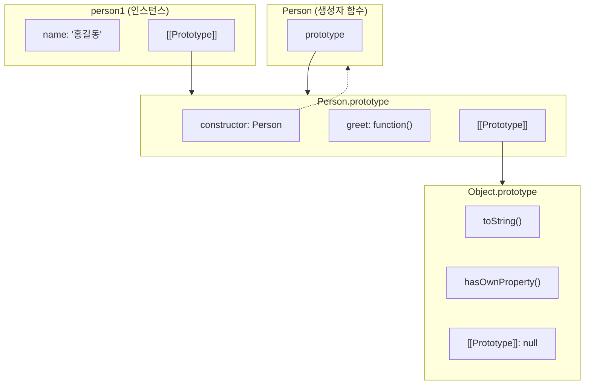

## 들어가며

JavaScript는 **프로토타입 기반(Prototype-based)** 언어입니다. Java나 C++같은 클래스 기반 언어와 달리, JavaScript는 프로토타입을 통해 객체 간 상속을 구현합니다. ES6에서 `class` 문법이 도입되었지만, 이는 프로토타입 기반 상속을 감싼 **문법적 설탕(Syntactic Sugar)**일 뿐입니다.

프로토타입을 이해하면 다음과 같은 질문에 답할 수 있습니다:

- 왜 배열에서 `map()`, `filter()` 같은 메서드를 사용할 수 있을까?
- `Object.create(null)`로 만든 객체가 왜 특별할까?
- `instanceof` 연산자는 어떻게 동작할까?
- ES6 class와 생성자 함수의 차이는 무엇일까?

> 프로토타입은 [JavaScript 클로저](/posts/javascript-closure-complete-guide/)와 함께 JavaScript의 핵심 개념입니다. 또한 객체의 기본 개념이 필요하다면 [JavaScript 객체 완벽 가이드](/posts/javascript-objects/)를 먼저 참고하세요.
{: .prompt-tip }

## 프로토타입이란 무엇인가

### 기본 개념

**프로토타입(Prototype)**은 JavaScript 객체가 다른 객체로부터 메서드와 속성을 상속받는 메커니즘입니다. 모든 JavaScript 객체는 자신의 **프로토타입 객체**에 대한 참조를 내부적으로 가지고 있습니다.

```javascript
// 일반 객체 생성
const person = {
  name: '홍길동',
  greet() {
    console.log(`안녕하세요, ${this.name}입니다.`);
  }
};

// person 객체에는 toString() 메서드를 정의하지 않았지만 사용 가능
console.log(person.toString()); // "[object Object]"

// 이것이 가능한 이유: 프로토타입 체인을 통해 Object.prototype의 메서드를 상속받기 때문
```

### 왜 프로토타입이 필요한가

프로토타입의 핵심 목적은 **메모리 효율성**과 **코드 재사용**입니다.

```javascript
// 프로토타입 없이 객체 생성 (비효율적)
function createPerson(name) {
  return {
    name: name,
    // 모든 객체마다 동일한 함수가 새로 생성됨 (메모리 낭비)
    greet: function() {
      console.log(`안녕하세요, ${this.name}입니다.`);
    }
  };
}

const person1 = createPerson('홍길동');
const person2 = createPerson('김철수');

// 각 객체가 별도의 greet 함수를 가짐
console.log(person1.greet === person2.greet); // false

// 프로토타입 사용 (효율적)
function Person(name) {
  this.name = name;
}

Person.prototype.greet = function() {
  console.log(`안녕하세요, ${this.name}입니다.`);
};

const person3 = new Person('홍길동');
const person4 = new Person('김철수');

// 모든 인스턴스가 동일한 메서드를 공유
console.log(person3.greet === person4.greet); // true
```

## [[Prototype]], __proto__, prototype의 차이

JavaScript에서 프로토타입과 관련된 세 가지 용어가 자주 혼동됩니다.

### 비교 표

| 용어 | 설명 | 접근 방법 | 존재 위치 |
|------|------|-----------|-----------|
| `[[Prototype]]` | 객체의 내부 슬롯, 실제 프로토타입 참조 | 직접 접근 불가 | 모든 객체 |
| `__proto__` | `[[Prototype]]`에 접근하는 접근자 프로퍼티 | `obj.__proto__` | 모든 객체 (비표준, 레거시) |
| `prototype` | 생성자 함수가 가진 프로퍼티, 인스턴스의 `[[Prototype]]`이 될 객체 | `Constructor.prototype` | 함수 객체만 |

### [[Prototype]] 내부 슬롯

모든 객체는 `[[Prototype]]`이라는 내부 슬롯을 가집니다. 이는 ECMAScript 명세에 정의된 내부 속성으로, 직접 접근할 수 없습니다.

```javascript
const obj = { name: '홍길동' };

// [[Prototype]]에 직접 접근할 수 없음
// console.log(obj.[[Prototype]]); // SyntaxError

// Object.getPrototypeOf()로 접근
console.log(Object.getPrototypeOf(obj)); // Object.prototype

// 또는 __proto__로 접근 (비권장)
console.log(obj.__proto__); // Object.prototype
```

### __proto__ 접근자 프로퍼티

`__proto__`는 `[[Prototype]]` 내부 슬롯에 접근하기 위한 접근자 프로퍼티입니다. 모든 객체가 `Object.prototype`으로부터 상속받습니다.

```javascript
const obj = {};

// __proto__는 Object.prototype의 접근자 프로퍼티
console.log(Object.getOwnPropertyDescriptor(Object.prototype, '__proto__'));
// { get: [Function: get __proto__], set: [Function: set __proto__], enumerable: false, configurable: true }

// getter와 setter를 통해 동작
const parent = { parentProp: 'parent' };
const child = { childProp: 'child' };

child.__proto__ = parent; // setter 호출

console.log(child.parentProp); // "parent" (프로토타입 체인을 통해 접근)
console.log(child.__proto__); // { parentProp: 'parent' } (getter 호출)
```

> **주의**: `__proto__`는 레거시 기능입니다. 대신 `Object.getPrototypeOf()`와 `Object.setPrototypeOf()`를 사용하세요.
{: .prompt-warning }

### prototype 프로퍼티

`prototype` 프로퍼티는 **함수 객체만** 가지고 있습니다. 이 프로퍼티는 해당 함수가 생성자로 사용될 때, 생성되는 인스턴스의 `[[Prototype]]`이 됩니다.

```javascript
// 함수는 prototype 프로퍼티를 가짐
function Person(name) {
  this.name = name;
}

console.log(Person.prototype); // { constructor: Person }
console.log(typeof Person.prototype); // "object"

// 일반 객체는 prototype 프로퍼티가 없음
const obj = {};
console.log(obj.prototype); // undefined

// 화살표 함수도 prototype 프로퍼티가 없음 (생성자로 사용 불가)
const arrowFunc = () => {};
console.log(arrowFunc.prototype); // undefined
```

### 관계 시각화



위 다이어그램에서 화살표의 의미:
- **실선 화살표**: `[[Prototype]]` 링크 (프로토타입 체인)
- **점선 화살표**: `constructor` 참조

## 프로토타입 체인의 동작 원리

### 프로퍼티 검색 과정

객체에서 프로퍼티에 접근할 때, JavaScript 엔진은 다음 순서로 검색합니다:

1. 객체 자신의 프로퍼티에서 검색
2. 없으면 `[[Prototype]]`이 참조하는 객체에서 검색
3. 없으면 그 객체의 `[[Prototype]]`에서 검색
4. `[[Prototype]]`이 `null`이 될 때까지 반복
5. 끝까지 없으면 `undefined` 반환

이 검색 과정은 [JavaScript 스코프 체인](/posts/javascript-scope/)의 변수 검색 과정과 유사한 개념입니다.

```javascript
const grandparent = {
  familyName: '홍',
  generation: 1
};

const parent = Object.create(grandparent);
parent.job = '회사원';
parent.generation = 2; // grandparent의 generation을 가림 (shadowing)

const child = Object.create(parent);
child.name = '길동';
child.generation = 3;

// 프로퍼티 검색 과정
console.log(child.name);        // "길동" (child 자신의 프로퍼티)
console.log(child.job);         // "회사원" (parent에서 찾음)
console.log(child.familyName);  // "홍" (grandparent에서 찾음)
console.log(child.generation);  // 3 (child 자신의 프로퍼티, shadowing)
console.log(child.notExist);    // undefined (체인 끝까지 없음)
```

### 프로토타입 체인 확인

```javascript
function Animal(name) {
  this.name = name;
}

Animal.prototype.speak = function() {
  console.log(`${this.name}이(가) 소리를 냅니다.`);
};

function Dog(name, breed) {
  Animal.call(this, name);
  this.breed = breed;
}

// Dog.prototype을 Animal.prototype을 상속받도록 설정
Dog.prototype = Object.create(Animal.prototype);
Dog.prototype.constructor = Dog;

Dog.prototype.bark = function() {
  console.log(`${this.name}이(가) 짖습니다: 멍멍!`);
};

const myDog = new Dog('바둑이', '진돗개');

// 프로토타입 체인 확인
console.log(myDog.__proto__ === Dog.prototype);                    // true
console.log(myDog.__proto__.__proto__ === Animal.prototype);       // true
console.log(myDog.__proto__.__proto__.__proto__ === Object.prototype); // true
console.log(myDog.__proto__.__proto__.__proto__.__proto__);        // null

// 메서드 호출
myDog.bark();  // "바둑이이(가) 짖습니다: 멍멍!"
myDog.speak(); // "바둑이이(가) 소리를 냅니다."
```

### hasOwnProperty vs in 연산자

```javascript
const parent = { inherited: true };
const child = Object.create(parent);
child.own = true;

// in 연산자: 프로토타입 체인 전체에서 검색
console.log('own' in child);       // true
console.log('inherited' in child); // true

// hasOwnProperty: 객체 자신의 프로퍼티만 검색
console.log(child.hasOwnProperty('own'));       // true
console.log(child.hasOwnProperty('inherited')); // false

// Object.hasOwn (ES2022, 권장)
console.log(Object.hasOwn(child, 'own'));       // true
console.log(Object.hasOwn(child, 'inherited')); // false
```

## 생성자 함수와 prototype

### 생성자 함수의 동작 원리

`new` 키워드로 함수를 호출하면 다음과 같은 과정이 일어납니다:

```javascript
function Person(name, age) {
  // 1. 빈 객체 생성 (암묵적)
  // this = {};

  // 2. this의 [[Prototype]]을 Person.prototype으로 설정 (암묵적)
  // Object.setPrototypeOf(this, Person.prototype);

  // 3. this에 프로퍼티 추가
  this.name = name;
  this.age = age;

  // 4. this 반환 (암묵적)
  // return this;
}

Person.prototype.greet = function() {
  console.log(`안녕하세요, ${this.name}입니다.`);
};

const person = new Person('홍길동', 30);
console.log(person); // Person { name: '홍길동', age: 30 }
```

### new 연산자 시뮬레이션

```javascript
function myNew(Constructor, ...args) {
  // 1. 빈 객체 생성, [[Prototype]] 설정
  const instance = Object.create(Constructor.prototype);

  // 2. 생성자 함수 호출 (this를 새 객체로 바인딩)
  const result = Constructor.apply(instance, args);

  // 3. 생성자가 객체를 반환하면 그것을 반환, 아니면 새 객체 반환
  return (typeof result === 'object' && result !== null) ? result : instance;
}

// 테스트
function Car(brand) {
  this.brand = brand;
}

Car.prototype.drive = function() {
  console.log(`${this.brand} 차량이 달립니다.`);
};

const myCar = myNew(Car, 'Tesla');
myCar.drive(); // "Tesla 차량이 달립니다."
console.log(myCar instanceof Car); // true
```

### constructor 프로퍼티

모든 `prototype` 객체는 `constructor` 프로퍼티를 가지며, 이는 생성자 함수 자신을 가리킵니다.

```javascript
function Person(name) {
  this.name = name;
}

// prototype.constructor는 생성자 함수를 가리킴
console.log(Person.prototype.constructor === Person); // true

const person = new Person('홍길동');

// 인스턴스에서 constructor 접근 (프로토타입 체인)
console.log(person.constructor === Person); // true

// constructor를 통해 새 인스턴스 생성
const person2 = new person.constructor('김철수');
console.log(person2.name); // "김철수"
```

### prototype 교체 시 주의사항

```javascript
function Person(name) {
  this.name = name;
}

// prototype 전체를 교체하면 constructor가 사라짐
Person.prototype = {
  greet() {
    console.log(`안녕하세요, ${this.name}입니다.`);
  }
};

const person = new Person('홍길동');
console.log(person.constructor === Person); // false
console.log(person.constructor === Object); // true (Object.prototype.constructor)

// 해결: constructor를 명시적으로 복원
Person.prototype = {
  constructor: Person, // constructor 복원
  greet() {
    console.log(`안녕하세요, ${this.name}입니다.`);
  }
};
```

## Object.create()를 활용한 프로토타입 상속

### 기본 사용법

`Object.create()`는 지정한 프로토타입 객체와 프로퍼티를 갖는 새 객체를 생성합니다.

```javascript
const personProto = {
  greet() {
    console.log(`안녕하세요, ${this.name}입니다.`);
  },
  introduce() {
    console.log(`저는 ${this.age}세 ${this.job}입니다.`);
  }
};

// personProto를 프로토타입으로 하는 새 객체 생성
const person = Object.create(personProto);
person.name = '홍길동';
person.age = 30;
person.job = '개발자';

person.greet();     // "안녕하세요, 홍길동입니다."
person.introduce(); // "저는 30세 개발자입니다."

// 프로토타입 확인
console.log(Object.getPrototypeOf(person) === personProto); // true
```

### 프로퍼티 디스크립터와 함께 사용

```javascript
const person = Object.create(personProto, {
  name: {
    value: '홍길동',
    writable: true,
    enumerable: true,
    configurable: true
  },
  age: {
    value: 30,
    writable: true,
    enumerable: true,
    configurable: true
  },
  // getter/setter 정의
  birthYear: {
    get() {
      return new Date().getFullYear() - this.age;
    },
    enumerable: true,
    configurable: true
  }
});

console.log(person.name);      // "홍길동"
console.log(person.birthYear); // 1995 (2025년 기준)
```

### 순수 딕셔너리 객체 생성

```javascript
// Object.prototype을 상속받지 않는 순수 객체
const dict = Object.create(null);

dict.key1 = 'value1';
dict.key2 = 'value2';

console.log(dict.key1); // "value1"

// Object.prototype 메서드 없음
console.log(dict.toString);        // undefined
console.log(dict.hasOwnProperty);  // undefined

// hasOwnProperty 충돌 방지
dict.hasOwnProperty = 'oops'; // 안전하게 프로퍼티로 사용 가능

// 일반 객체에서는 위험
const normalObj = {};
normalObj.hasOwnProperty = 'oops';
// normalObj.hasOwnProperty('key'); // TypeError: hasOwnProperty is not a function
```

### 상속 패턴 구현

```javascript
// 부모 생성자
function Animal(name) {
  this.name = name;
  this.isAlive = true;
}

Animal.prototype.eat = function() {
  console.log(`${this.name}이(가) 먹습니다.`);
};

Animal.prototype.sleep = function() {
  console.log(`${this.name}이(가) 잠을 잡니다.`);
};

// 자식 생성자
function Dog(name, breed) {
  // 부모 생성자 호출 (super 역할)
  Animal.call(this, name);
  this.breed = breed;
}

// 프로토타입 상속 설정
Dog.prototype = Object.create(Animal.prototype);
Dog.prototype.constructor = Dog;

// 자식만의 메서드 추가
Dog.prototype.bark = function() {
  console.log(`${this.name}이(가) 짖습니다: 멍멍!`);
};

// 부모 메서드 오버라이딩
Dog.prototype.eat = function() {
  console.log(`${this.name}이(가) 사료를 먹습니다.`);
};

const myDog = new Dog('바둑이', '진돗개');

myDog.eat();   // "바둑이이(가) 사료를 먹습니다." (오버라이딩된 메서드)
myDog.sleep(); // "바둑이이(가) 잠을 잡니다." (상속된 메서드)
myDog.bark();  // "바둑이이(가) 짖습니다: 멍멍!" (자식만의 메서드)

console.log(myDog instanceof Dog);    // true
console.log(myDog instanceof Animal); // true
console.log(myDog instanceof Object); // true
```

## Object.getPrototypeOf(), Object.setPrototypeOf() 활용

### Object.getPrototypeOf()

객체의 프로토타입(`[[Prototype]]`)을 반환합니다.

```javascript
const arr = [1, 2, 3];
const obj = { a: 1 };

function Person() {}
const person = new Person();

// 다양한 객체의 프로토타입 확인
console.log(Object.getPrototypeOf(arr) === Array.prototype);     // true
console.log(Object.getPrototypeOf(obj) === Object.prototype);    // true
console.log(Object.getPrototypeOf(person) === Person.prototype); // true

// 프로토타입 체인 탐색
let current = person;
while (current !== null) {
  console.log(current);
  current = Object.getPrototypeOf(current);
}
// Person {} -> Person.prototype -> Object.prototype -> null
```

### Object.setPrototypeOf()

객체의 프로토타입을 변경합니다.

```javascript
const animal = {
  speak() {
    console.log(`${this.name}이(가) 소리를 냅니다.`);
  }
};

const dog = {
  name: '바둑이',
  bark() {
    console.log('멍멍!');
  }
};

// dog의 프로토타입을 animal로 설정
Object.setPrototypeOf(dog, animal);

dog.bark();  // "멍멍!"
dog.speak(); // "바둑이이(가) 소리를 냅니다."
```

> **성능 경고**: `Object.setPrototypeOf()`는 매우 느린 연산입니다. 객체 생성 이후 프로토타입을 변경하면 JavaScript 엔진의 최적화를 방해합니다. 가능하면 `Object.create()`를 사용하세요.
{: .prompt-warning }

### isPrototypeOf() 메서드

```javascript
function Animal() {}
function Dog() {}

Dog.prototype = Object.create(Animal.prototype);
Dog.prototype.constructor = Dog;

const myDog = new Dog();

// isPrototypeOf(): 프로토타입 체인에 존재하는지 확인
console.log(Dog.prototype.isPrototypeOf(myDog));    // true
console.log(Animal.prototype.isPrototypeOf(myDog)); // true
console.log(Object.prototype.isPrototypeOf(myDog)); // true

// instanceof와의 비교
console.log(myDog instanceof Dog);    // true
console.log(myDog instanceof Animal); // true
console.log(myDog instanceof Object); // true
```

## 클래스와 프로토타입의 관계

### ES6 Class는 Syntactic Sugar

ES6의 `class`는 프로토타입 기반 상속을 더 쉽게 작성하기 위한 문법적 설탕입니다. class 문법에 대한 자세한 내용은 [JavaScript 클래스 완벽 가이드](/posts/javascript-class/)를 참고하세요.

```javascript
// ES6 Class
class Person {
  constructor(name, age) {
    this.name = name;
    this.age = age;
  }

  greet() {
    console.log(`안녕하세요, ${this.name}입니다.`);
  }

  static create(name, age) {
    return new Person(name, age);
  }
}

// 위 class는 아래와 동등함
function PersonES5(name, age) {
  this.name = name;
  this.age = age;
}

PersonES5.prototype.greet = function() {
  console.log(`안녕하세요, ${this.name}입니다.`);
};

PersonES5.create = function(name, age) {
  return new PersonES5(name, age);
};

// 동작 확인
const person1 = new Person('홍길동', 30);
const person2 = new PersonES5('홍길동', 30);

console.log(typeof Person);   // "function"
console.log(typeof PersonES5); // "function"
```

### Class와 생성자 함수의 차이

```javascript
class ClassExample {
  constructor(value) {
    this.value = value;
  }
  method() {}
}

function FunctionExample(value) {
  this.value = value;
}
FunctionExample.prototype.method = function() {};

// 차이점 1: class는 new 없이 호출 불가
// ClassExample(); // TypeError: Class constructor cannot be invoked without 'new'
FunctionExample(); // 에러 없음 (this가 전역 객체)

// 차이점 2: class의 메서드는 non-enumerable
console.log(Object.keys(ClassExample.prototype));    // []
console.log(Object.keys(FunctionExample.prototype)); // ['method']

// 차이점 3: class는 strict mode
class StrictClass {
  method() {
    // 'use strict' 자동 적용
    // this가 undefined (메서드 분리 시)
  }
}

// 차이점 4: class는 호이스팅 되지 않음 (TDZ)
// const instance = new MyClass(); // ReferenceError
// class MyClass {}
```

### 클래스 상속과 프로토타입

```javascript
class Animal {
  constructor(name) {
    this.name = name;
  }

  speak() {
    console.log(`${this.name}이(가) 소리를 냅니다.`);
  }
}

class Dog extends Animal {
  constructor(name, breed) {
    super(name); // Animal의 constructor 호출
    this.breed = breed;
  }

  bark() {
    console.log('멍멍!');
  }

  // 메서드 오버라이딩
  speak() {
    console.log(`${this.name}이(가) 짖습니다.`);
  }
}

const myDog = new Dog('바둑이', '진돗개');

// 프로토타입 체인 확인
console.log(Object.getPrototypeOf(Dog.prototype) === Animal.prototype); // true
console.log(myDog instanceof Dog);    // true
console.log(myDog instanceof Animal); // true

// extends는 내부적으로 다음과 같이 동작
// Dog.prototype = Object.create(Animal.prototype);
// Object.setPrototypeOf(Dog, Animal); // 정적 메서드 상속
```

### super 키워드의 동작

```javascript
class Parent {
  constructor(name) {
    this.name = name;
  }

  greet() {
    return `안녕하세요, ${this.name}입니다.`;
  }
}

class Child extends Parent {
  constructor(name, age) {
    super(name); // Parent.prototype.constructor.call(this, name)
    this.age = age;
  }

  greet() {
    // super.greet()은 Parent.prototype.greet.call(this)와 동등
    return `${super.greet()} ${this.age}세입니다.`;
  }
}

const child = new Child('홍길동', 10);
console.log(child.greet()); // "안녕하세요, 홍길동입니다. 10세입니다."
```

## 프로토타입 오염(Prototype Pollution) 보안 이슈

### 프로토타입 오염이란

프로토타입 오염은 공격자가 JavaScript 객체의 프로토타입을 수정하여 애플리케이션의 동작을 변경할 수 있는 보안 취약점입니다.

```javascript
// 취약한 객체 병합 함수
function vulnerableMerge(target, source) {
  for (const key in source) {
    if (typeof source[key] === 'object' && source[key] !== null) {
      if (!target[key]) target[key] = {};
      vulnerableMerge(target[key], source[key]);
    } else {
      target[key] = source[key];
    }
  }
  return target;
}

// 공격 시나리오
const maliciousPayload = JSON.parse('{"__proto__": {"isAdmin": true}}');
const userConfig = {};

vulnerableMerge(userConfig, maliciousPayload);

// 모든 객체가 영향받음
const newUser = {};
console.log(newUser.isAdmin); // true (프로토타입 오염!)

// 인증 우회 가능
function checkAdmin(user) {
  return user.isAdmin === true;
}
console.log(checkAdmin({})); // true (취약점!)
```

### 방어 방법

```javascript
// 1. Object.create(null) 사용
const safeDict = Object.create(null);
// __proto__ 프로퍼티가 없음

// 2. 안전한 병합 함수
function safeMerge(target, source) {
  for (const key in source) {
    // __proto__, constructor, prototype 키 차단
    if (key === '__proto__' || key === 'constructor' || key === 'prototype') {
      continue;
    }

    if (source.hasOwnProperty(key)) {
      if (typeof source[key] === 'object' && source[key] !== null) {
        if (!target[key]) target[key] = {};
        safeMerge(target[key], source[key]);
      } else {
        target[key] = source[key];
      }
    }
  }
  return target;
}

// 3. Object.freeze로 프로토타입 보호
Object.freeze(Object.prototype);
// Object.prototype 수정 시도 시 무시됨 (strict mode에서는 에러)

// 4. Map 사용
const safeMap = new Map();
safeMap.set('key', 'value');
// 프로토타입 오염 영향 없음
```

### 실제 사례와 예방

```javascript
// 실제 취약점이 발견된 라이브러리 패턴
// lodash, jQuery.extend, deepmerge 등

// 안전한 깊은 복사 (ES2023+)
const original = { nested: { value: 1 } };
const copy = structuredClone(original);

// 안전한 객체 생성
const safeObject = Object.create(null, {
  name: { value: '홍길동', writable: true, enumerable: true },
  age: { value: 30, writable: true, enumerable: true }
});

// JSON 파싱 시 주의
function parseJSON(jsonString) {
  const parsed = JSON.parse(jsonString);

  // 위험한 키 제거
  function sanitize(obj) {
    if (typeof obj !== 'object' || obj === null) return obj;

    const result = Array.isArray(obj) ? [] : Object.create(null);

    for (const key in obj) {
      if (key === '__proto__' || key === 'constructor' || key === 'prototype') {
        continue;
      }
      result[key] = sanitize(obj[key]);
    }

    return result;
  }

  return sanitize(parsed);
}
```

## 실무에서의 프로토타입 활용 사례

### 1. 내장 객체 확장 (주의 필요)

```javascript
// String.prototype 확장 예시 (권장하지 않음)
// 라이브러리 충돌 가능성 있음
String.prototype.toTitleCase = function() {
  return this.split(' ')
    .map(word => word.charAt(0).toUpperCase() + word.slice(1).toLowerCase())
    .join(' ');
};

console.log('hello world'.toTitleCase()); // "Hello World"

// 더 안전한 방법: 유틸리티 함수 사용
function toTitleCase(str) {
  return str.split(' ')
    .map(word => word.charAt(0).toUpperCase() + word.slice(1).toLowerCase())
    .join(' ');
}
```

### 2. 폴리필 구현

```javascript
// Array.prototype.flat 폴리필 (ES2019 이전 환경)
if (!Array.prototype.flat) {
  Array.prototype.flat = function(depth = 1) {
    const flatten = (arr, d) => {
      return d > 0
        ? arr.reduce((acc, val) =>
            acc.concat(Array.isArray(val) ? flatten(val, d - 1) : val), [])
        : arr.slice();
    };
    return flatten(this, depth);
  };
}

// Object.hasOwn 폴리필 (ES2022 이전 환경)
if (!Object.hasOwn) {
  Object.hasOwn = function(obj, prop) {
    return Object.prototype.hasOwnProperty.call(obj, prop);
  };
}
```

### 3. 믹스인(Mixin) 패턴

```javascript
// 믹스인 객체들
const canWalk = {
  walk() {
    console.log(`${this.name}이(가) 걷습니다.`);
  }
};

const canSwim = {
  swim() {
    console.log(`${this.name}이(가) 수영합니다.`);
  }
};

const canFly = {
  fly() {
    console.log(`${this.name}이(가) 날아갑니다.`);
  }
};

// 클래스에 믹스인 적용
class Animal {
  constructor(name) {
    this.name = name;
  }
}

class Duck extends Animal {}

// 여러 믹스인 적용
Object.assign(Duck.prototype, canWalk, canSwim, canFly);

const duck = new Duck('도날드');
duck.walk(); // "도날드이(가) 걷습니다."
duck.swim(); // "도날드이(가) 수영합니다."
duck.fly();  // "도날드이(가) 날아갑니다."
```

### 4. 메서드 체이닝

```javascript
function QueryBuilder() {
  this.query = {};
}

QueryBuilder.prototype.select = function(fields) {
  this.query.select = fields;
  return this; // 메서드 체이닝을 위해 this 반환
};

QueryBuilder.prototype.from = function(table) {
  this.query.from = table;
  return this;
};

QueryBuilder.prototype.where = function(condition) {
  if (!this.query.where) this.query.where = [];
  this.query.where.push(condition);
  return this;
};

QueryBuilder.prototype.build = function() {
  return this.query;
};

// 사용 예시
const query = new QueryBuilder()
  .select(['id', 'name', 'email'])
  .from('users')
  .where({ active: true })
  .where({ role: 'admin' })
  .build();

console.log(query);
// { select: ['id', 'name', 'email'], from: 'users', where: [{ active: true }, { role: 'admin' }] }
```

### 5. instanceof 커스터마이징

```javascript
class MyArray {
  static [Symbol.hasInstance](instance) {
    return Array.isArray(instance);
  }
}

console.log([] instanceof MyArray);       // true
console.log([1, 2, 3] instanceof MyArray); // true
console.log('array' instanceof MyArray);   // false

// 덕 타이핑 구현
class Iterable {
  static [Symbol.hasInstance](instance) {
    return instance != null && typeof instance[Symbol.iterator] === 'function';
  }
}

console.log([1, 2, 3] instanceof Iterable);     // true
console.log('hello' instanceof Iterable);       // true
console.log(new Map() instanceof Iterable);     // true
console.log({ a: 1 } instanceof Iterable);      // false
```

## 성능 고려사항

프로토타입 체인 탐색은 [JavaScript 콜 스택](/posts/javascript-call-stack/)과 함께 성능에 영향을 미치는 중요한 요소입니다.

### 프로토타입 체인 길이

프로토타입 체인이 길수록 프로퍼티 검색 시간이 증가합니다.

```javascript
// 깊은 프로토타입 체인 (비효율적)
const level1 = { a: 1 };
const level2 = Object.create(level1);
level2.b = 2;
const level3 = Object.create(level2);
level3.c = 3;
const level4 = Object.create(level3);
level4.d = 4;

// level1.a에 접근하려면 4단계 탐색 필요
console.log(level4.a); // 1 (느림)

// 얕은 체인 (효율적)
const flat = {
  a: 1, b: 2, c: 3, d: 4
};
console.log(flat.a); // 1 (빠름)
```

### Object.setPrototypeOf() 성능 문제

```javascript
// 나쁜 예: 런타임에 프로토타입 변경
const obj = { value: 1 };
Object.setPrototypeOf(obj, { method() {} }); // V8 최적화 해제

// 좋은 예: 생성 시점에 프로토타입 설정
const proto = { method() {} };
const obj2 = Object.create(proto);
obj2.value = 1;
```

### hasOwnProperty vs in 성능

```javascript
const obj = { own: true };
const proto = { inherited: true };
Object.setPrototypeOf(obj, proto);

// hasOwnProperty: 자신의 프로퍼티만 확인 (빠름)
console.time('hasOwnProperty');
for (let i = 0; i < 1000000; i++) {
  obj.hasOwnProperty('own');
}
console.timeEnd('hasOwnProperty');

// in: 프로토타입 체인 전체 탐색 (상대적으로 느림)
console.time('in operator');
for (let i = 0; i < 1000000; i++) {
  'own' in obj;
}
console.timeEnd('in operator');
```

### 최적화 팁

```javascript
// 1. 프로토타입 메서드보다 자주 사용되는 메서드는 인스턴스에 직접 할당
function FastClass(frequentlyUsedFn) {
  this.frequentlyUsed = frequentlyUsedFn; // 빠른 접근
}
FastClass.prototype.rarelyUsed = function() {}; // 프로토타입에 유지

// 2. 프로퍼티 접근 캐싱
function process(obj) {
  // 나쁜 예
  for (let i = 0; i < 1000; i++) {
    console.log(obj.deeply.nested.property);
  }

  // 좋은 예
  const cached = obj.deeply.nested.property;
  for (let i = 0; i < 1000; i++) {
    console.log(cached);
  }
}

// 3. 히든 클래스 최적화 (V8)
// 같은 순서로 프로퍼티 추가하면 같은 히든 클래스 공유
function Point(x, y) {
  this.x = x; // 항상 x 먼저
  this.y = y; // 그 다음 y
}

const p1 = new Point(1, 2);
const p2 = new Point(3, 4);
// p1과 p2는 같은 히든 클래스 공유 -> 최적화
```

## 핵심 정리

### 프로토타입 관련 용어

| 용어 | 설명 |
|------|------|
| `[[Prototype]]` | 모든 객체가 가진 내부 슬롯, 프로토타입 객체 참조 |
| `__proto__` | `[[Prototype]]`에 접근하는 접근자 프로퍼티 (비권장) |
| `prototype` | 함수 객체만 가진 프로퍼티, 인스턴스의 프로토타입이 될 객체 |
| 프로토타입 체인 | 객체의 프로토타입을 따라 프로퍼티를 검색하는 메커니즘 |

### 주요 메서드

| 메서드 | 용도 |
|--------|------|
| `Object.create(proto)` | 지정한 프로토타입으로 새 객체 생성 |
| `Object.getPrototypeOf(obj)` | 객체의 프로토타입 반환 |
| `Object.setPrototypeOf(obj, proto)` | 객체의 프로토타입 변경 (비권장) |
| `obj.hasOwnProperty(prop)` | 자신의 프로퍼티인지 확인 |
| `Object.hasOwn(obj, prop)` | 자신의 프로퍼티인지 확인 (ES2022) |
| `proto.isPrototypeOf(obj)` | 프로토타입 체인에 존재하는지 확인 |

### 기억해야 할 것

1. JavaScript는 **프로토타입 기반** 언어이며, ES6 class는 문법적 설탕입니다.
2. 모든 객체는 `[[Prototype]]`을 통해 다른 객체와 연결됩니다.
3. 프로퍼티 검색은 프로토타입 체인을 따라 진행됩니다.
4. `Object.create(null)`로 순수 딕셔너리 객체를 만들 수 있습니다.
5. 프로토타입 오염은 보안 취약점이므로 주의해야 합니다.
6. 런타임에 프로토타입 변경은 성능에 악영향을 줍니다.

## 관련 포스트

- [JavaScript 클로저(Closure) 완벽 가이드](/posts/javascript-closure-complete-guide/) - 클로저와 렉시컬 스코프
- [JavaScript 스코프 완벽 가이드](/posts/javascript-scope/) - 스코프 체인과 변수 검색
- [JavaScript 클래스 완벽 가이드](/posts/javascript-class/) - ES6 class 문법 상세
- [JavaScript 객체 완벽 가이드](/posts/javascript-objects/) - 객체 기본 개념
- [JavaScript 콜 스택 이해하기](/posts/javascript-call-stack/) - 실행 컨텍스트와 성능

## 참고 자료

- [MDN - Object prototypes](https://developer.mozilla.org/ko/docs/Learn/JavaScript/Objects/Object_prototypes)
- [MDN - Inheritance and the prototype chain](https://developer.mozilla.org/ko/docs/Web/JavaScript/Inheritance_and_the_prototype_chain)
- [MDN - Object.create()](https://developer.mozilla.org/ko/docs/Web/JavaScript/Reference/Global_Objects/Object/create)
- [MDN - Object.getPrototypeOf()](https://developer.mozilla.org/ko/docs/Web/JavaScript/Reference/Global_Objects/Object/getPrototypeOf)
- [JavaScript.info - Prototypes, inheritance](https://ko.javascript.info/prototypes)
- [V8 Blog - Fast properties in V8](https://v8.dev/blog/fast-properties)
- [OWASP - Prototype Pollution](https://cheatsheetseries.owasp.org/cheatsheets/Prototype_Pollution_Prevention_Cheat_Sheet.html)
