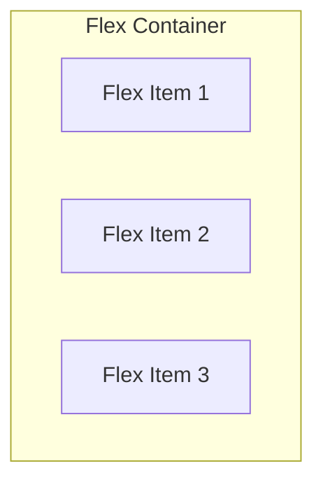
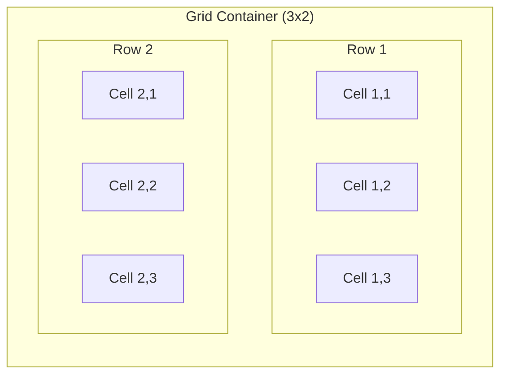

## 개요

현대 웹 개발에서 레이아웃은 **Flexbox**와 **Grid**가 주도합니다. 과거 [Float 기반 레이아웃](/posts/css-float/)이나 테이블 기반 레이아웃의 한계를 극복하고, 복잡한 레이아웃을 직관적이고 유연하게 구현할 수 있게 해주는 강력한 CSS 도구입니다.

이 가이드에서는 다음을 학습합니다:

- **Flexbox**: 1차원(한 방향) 레이아웃을 위한 도구
- **Grid**: 2차원(행과 열) 레이아웃을 위한 도구
- **실전 패턴**: Holy Grail, 반응형 카드 그리드, 대시보드 등
- **선택 가이드**: 언제 어떤 도구를 사용할지

> 이 글은 [CSS Display 속성](/posts/css-display-block-inline/)과 [CSS Position](/posts/css-position/)을 이해하고 있다고 가정합니다.
{: .prompt-info }

---

## Part 1: Flexbox - 1차원 레이아웃의 마스터

### 1.1 Flexbox 기본 개념

Flexbox(Flexible Box)는 **한 방향**(수평 또는 수직)으로 요소를 배치하는 레이아웃 시스템입니다.

```css
.container {
  display: flex; /* Flex Container가 됨 */
}
```

Flexbox에는 두 가지 핵심 요소가 있습니다:

| 용어 | 설명 |
|------|------|
| **Flex Container** | `display: flex`가 적용된 부모 요소 |
| **Flex Item** | Flex Container의 직접 자식 요소들 |



### 1.2 주축(Main Axis)과 교차축(Cross Axis)

Flexbox 이해의 핵심은 **두 개의 축**을 이해하는 것입니다.

```css
.container {
  display: flex;
  flex-direction: row; /* 기본값: 주축이 수평 */
}
```

| flex-direction | 주축(Main Axis) | 교차축(Cross Axis) |
|----------------|-----------------|-------------------|
| `row` (기본값) | 왼쪽 → 오른쪽 | 위 → 아래 |
| `row-reverse` | 오른쪽 → 왼쪽 | 위 → 아래 |
| `column` | 위 → 아래 | 왼쪽 → 오른쪽 |
| `column-reverse` | 아래 → 위 | 왼쪽 → 오른쪽 |

```css
/* 세로 방향 레이아웃 */
.vertical-container {
  display: flex;
  flex-direction: column;
}
```

### 1.3 Container 속성

#### flex-wrap: 줄바꿈 제어

```css
.container {
  display: flex;
  flex-wrap: nowrap; /* 기본값: 한 줄에 모두 배치 */
  flex-wrap: wrap;   /* 넘치면 다음 줄로 */
  flex-wrap: wrap-reverse; /* 역방향 줄바꿈 */
}
```

#### flex-flow: 축약형

```css
/* flex-direction + flex-wrap */
.container {
  flex-flow: row wrap;
}
```

#### justify-content: 주축 정렬

주축을 따라 아이템들을 어떻게 정렬할지 결정합니다.

```css
.container {
  display: flex;
  justify-content: flex-start;    /* 시작점 정렬 (기본값) */
  justify-content: flex-end;      /* 끝점 정렬 */
  justify-content: center;        /* 중앙 정렬 */
  justify-content: space-between; /* 양끝 배치, 사이 균등 */
  justify-content: space-around;  /* 아이템 주변 균등 여백 */
  justify-content: space-evenly;  /* 모든 간격 균등 */
}
```

**시각적 비교:**

```
justify-content: flex-start
[A][B][C]

justify-content: center
       [A][B][C]

justify-content: space-between
[A]       [B]       [C]

justify-content: space-evenly
   [A]    [B]    [C]
```

#### align-items: 교차축 정렬

교차축을 따라 아이템들을 어떻게 정렬할지 결정합니다.

```css
.container {
  display: flex;
  height: 200px;
  align-items: stretch;    /* 늘려서 채움 (기본값) */
  align-items: flex-start; /* 교차축 시작점 */
  align-items: flex-end;   /* 교차축 끝점 */
  align-items: center;     /* 교차축 중앙 */
  align-items: baseline;   /* 텍스트 기준선 정렬 */
}
```

#### align-content: 여러 줄 정렬

`flex-wrap: wrap`으로 여러 줄이 생겼을 때, 줄들의 정렬을 제어합니다.

```css
.container {
  display: flex;
  flex-wrap: wrap;
  align-content: flex-start;    /* 위쪽으로 모음 */
  align-content: flex-end;      /* 아래쪽으로 모음 */
  align-content: center;        /* 세로 중앙 */
  align-content: space-between; /* 줄 사이 균등 배분 */
  align-content: space-around;  /* 줄 주변 균등 여백 */
  align-content: stretch;       /* 줄을 늘려서 채움 (기본값) */
}
```

### 1.4 Item 속성

#### flex-grow: 남은 공간 차지 비율

```css
.item {
  flex-grow: 0; /* 기본값: 늘어나지 않음 */
  flex-grow: 1; /* 남은 공간을 1의 비율로 차지 */
}

/* 예시: 1:2:1 비율로 공간 분배 */
.item1 { flex-grow: 1; }
.item2 { flex-grow: 2; } /* 2배의 공간 차지 */
.item3 { flex-grow: 1; }
```

#### flex-shrink: 공간 부족 시 축소 비율

```css
.item {
  flex-shrink: 1; /* 기본값: 같은 비율로 줄어듦 */
  flex-shrink: 0; /* 줄어들지 않음 */
  flex-shrink: 2; /* 2배 비율로 줄어듦 */
}
```

#### flex-basis: 기본 크기

주축 방향의 기본 크기를 설정합니다.

```css
.item {
  flex-basis: auto;  /* 기본값: content 크기 */
  flex-basis: 200px; /* 200px 기본 크기 */
  flex-basis: 30%;   /* 부모의 30% */
  flex-basis: 0;     /* flex-grow로만 크기 결정 */
}
```

#### flex: 축약형 (권장)

```css
.item {
  /* flex: grow shrink basis */
  flex: 0 1 auto; /* 기본값 */
  flex: 1;        /* flex: 1 1 0% - 균등 분배 */
  flex: auto;     /* flex: 1 1 auto */
  flex: none;     /* flex: 0 0 auto - 고정 크기 */
}
```

> **실무 팁**: 대부분의 경우 `flex: 1`이나 `flex: none`으로 충분합니다.
{: .prompt-tip }

#### align-self: 개별 아이템 정렬

```css
.item {
  align-self: auto;       /* 기본값: align-items 따름 */
  align-self: flex-start;
  align-self: flex-end;
  align-self: center;
  align-self: stretch;
}
```

#### order: 배치 순서

```css
.item1 { order: 2; } /* 두 번째로 표시 */
.item2 { order: 1; } /* 첫 번째로 표시 */
.item3 { order: 3; } /* 세 번째로 표시 */
```

### 1.5 Flexbox 실전 패턴

#### 패턴 1: 완벽한 중앙 정렬

가장 많이 사용되는 패턴입니다.

```css
.center {
  display: flex;
  justify-content: center;
  align-items: center;
  height: 100vh;
}
```

```html
<div class="center">
  <div class="content">완벽하게 중앙에 배치됩니다</div>
</div>
```

#### 패턴 2: 네비게이션 바

```css
.navbar {
  display: flex;
  justify-content: space-between;
  align-items: center;
  padding: 1rem 2rem;
  background: #333;
}

.navbar__logo {
  font-size: 1.5rem;
  font-weight: bold;
  color: white;
}

.navbar__menu {
  display: flex;
  gap: 1.5rem; /* 메뉴 아이템 간격 */
  list-style: none;
}

.navbar__menu a {
  color: white;
  text-decoration: none;
}

.navbar__actions {
  display: flex;
  gap: 1rem;
}
```

```html
<nav class="navbar">
  <div class="navbar__logo">Logo</div>
  <ul class="navbar__menu">
    <li><a href="#">Home</a></li>
    <li><a href="#">About</a></li>
    <li><a href="#">Services</a></li>
    <li><a href="#">Contact</a></li>
  </ul>
  <div class="navbar__actions">
    <button>Login</button>
    <button>Sign Up</button>
  </div>
</nav>
```

#### 패턴 3: 카드 레이아웃

```css
.card-container {
  display: flex;
  flex-wrap: wrap;
  gap: 1.5rem;
  padding: 1.5rem;
}

.card {
  flex: 1 1 300px; /* 최소 300px, 늘어날 수 있음 */
  max-width: 400px;
  display: flex;
  flex-direction: column;
  border: 1px solid #ddd;
  border-radius: 8px;
  overflow: hidden;
}

.card__image {
  width: 100%;
  height: 200px;
  object-fit: cover;
}

.card__content {
  flex: 1; /* 내용 영역이 늘어남 */
  padding: 1rem;
}

.card__footer {
  padding: 1rem;
  border-top: 1px solid #eee;
  margin-top: auto; /* 항상 하단에 위치 */
}
```

#### 패턴 4: Sticky Footer

페이지 내용이 적어도 Footer가 항상 화면 하단에 위치합니다.

```css
body {
  min-height: 100vh;
  display: flex;
  flex-direction: column;
  margin: 0;
}

main {
  flex: 1; /* 남은 공간을 모두 차지 */
}

footer {
  background: #333;
  color: white;
  padding: 2rem;
}
```

```html
<body>
  <header>Header</header>
  <main>Main Content (짧아도 괜찮음)</main>
  <footer>Always at the bottom</footer>
</body>
```

#### 패턴 5: 균등 분할 레이아웃

```css
.equal-columns {
  display: flex;
  gap: 1rem;
}

.equal-columns > * {
  flex: 1; /* 모든 자식이 동일한 너비 */
}

/* 특정 열만 다른 비율 */
.equal-columns .wide {
  flex: 2; /* 다른 열의 2배 */
}
```

---

## Part 2: Grid - 2차원 레이아웃의 혁명

### 2.1 Grid 기본 개념

CSS Grid는 **행(row)과 열(column)**을 동시에 다루는 2차원 레이아웃 시스템입니다.

```css
.container {
  display: grid;
  grid-template-columns: 1fr 1fr 1fr; /* 3개의 동일한 열 */
  grid-template-rows: 100px 200px;     /* 2개의 행 */
  gap: 1rem;
}
```

| 용어 | 설명 |
|------|------|
| **Grid Container** | `display: grid`가 적용된 요소 |
| **Grid Item** | Grid Container의 직접 자식 요소 |
| **Grid Line** | 그리드를 나누는 수평/수직 선 |
| **Grid Track** | 두 인접한 Grid Line 사이의 공간 (행 또는 열) |
| **Grid Cell** | 하나의 행과 열이 만나는 단일 공간 |
| **Grid Area** | 하나 이상의 Grid Cell로 이루어진 영역 |



### 2.2 Container 속성

#### grid-template-columns / grid-template-rows

```css
.container {
  display: grid;

  /* 고정 크기 */
  grid-template-columns: 100px 200px 100px;

  /* fr 단위 (fraction) */
  grid-template-columns: 1fr 2fr 1fr; /* 1:2:1 비율 */

  /* 혼합 */
  grid-template-columns: 200px 1fr 200px; /* 고정-유연-고정 */

  /* repeat() 함수 */
  grid-template-columns: repeat(3, 1fr); /* 1fr 1fr 1fr */
  grid-template-columns: repeat(4, 100px); /* 100px 4번 반복 */
}
```

#### fr 단위 이해하기

`fr`은 **사용 가능한 공간의 비율**을 나타냅니다.

```css
.container {
  display: grid;
  width: 900px;
  grid-template-columns: 200px 1fr 2fr;
  /*
    200px: 고정
    1fr: (900-200) / 3 = 233.33px
    2fr: (900-200) / 3 * 2 = 466.67px
  */
}
```

#### gap (구 grid-gap)

```css
.container {
  display: grid;
  gap: 1rem;              /* 행과 열 간격 동일 */
  gap: 1rem 2rem;         /* 행 간격 1rem, 열 간격 2rem */

  /* 개별 지정 */
  row-gap: 1rem;
  column-gap: 2rem;
}
```

### 2.3 repeat()와 자동 배치

#### repeat() 함수

```css
.container {
  display: grid;

  /* 기본 반복 */
  grid-template-columns: repeat(6, 1fr);

  /* 패턴 반복 */
  grid-template-columns: repeat(3, 100px 1fr); /* 100px 1fr 100px 1fr 100px 1fr */
}
```

#### auto-fill vs auto-fit

**반응형 그리드의 핵심!**

```css
/* auto-fill: 가능한 많은 열 생성 (빈 열 유지) */
.auto-fill {
  display: grid;
  grid-template-columns: repeat(auto-fill, minmax(200px, 1fr));
  gap: 1rem;
}

/* auto-fit: 가능한 많은 열 생성 (빈 열 축소) */
.auto-fit {
  display: grid;
  grid-template-columns: repeat(auto-fit, minmax(200px, 1fr));
  gap: 1rem;
}
```

**차이점:**
- `auto-fill`: 아이템이 적어도 빈 열 공간이 유지됨
- `auto-fit`: 아이템이 적으면 남은 공간을 기존 아이템이 채움

#### minmax() 함수

```css
.container {
  display: grid;
  grid-template-columns: minmax(200px, 1fr) 2fr minmax(100px, 300px);
  /*
    첫 번째 열: 최소 200px, 최대 1fr
    두 번째 열: 2fr
    세 번째 열: 최소 100px, 최대 300px
  */
}
```

### 2.4 Item 배치

#### grid-column / grid-row

Grid Line 번호를 사용해 아이템을 배치합니다.

```css
.item {
  /* 열 1번 라인에서 3번 라인까지 */
  grid-column: 1 / 3;

  /* span 키워드 사용 */
  grid-column: span 2; /* 2개의 열 차지 */

  /* 행과 열 모두 지정 */
  grid-column: 1 / 3;
  grid-row: 1 / 2;
}
```

```
Grid Lines:
     1     2     3     4
     |     |     |     |
  1 -+-----+-----+-----+
     |     |     |     |
  2 -+-----+-----+-----+
     |     |     |     |
  3 -+-----+-----+-----+
```

#### grid-area: 영역 이름으로 배치

```css
.container {
  display: grid;
  grid-template-columns: 200px 1fr 200px;
  grid-template-rows: auto 1fr auto;
  grid-template-areas:
    "header header header"
    "sidebar main aside"
    "footer footer footer";
  min-height: 100vh;
  gap: 1rem;
}

header { grid-area: header; }
.sidebar { grid-area: sidebar; }
main { grid-area: main; }
aside { grid-area: aside; }
footer { grid-area: footer; }
```

```html
<div class="container">
  <header>Header</header>
  <nav class="sidebar">Sidebar</nav>
  <main>Main Content</main>
  <aside>Right Sidebar</aside>
  <footer>Footer</footer>
</div>
```

> `grid-template-areas`에서 `.`(점)은 빈 셀을 의미합니다.
{: .prompt-info }

### 2.5 Grid 실전 패턴

#### 패턴 1: Holy Grail 레이아웃

웹 레이아웃의 고전적인 패턴입니다.

```css
.holy-grail {
  display: grid;
  grid-template-columns: 200px 1fr 200px;
  grid-template-rows: auto 1fr auto;
  grid-template-areas:
    "header header header"
    "nav    main   aside"
    "footer footer footer";
  min-height: 100vh;
  gap: 1rem;
  padding: 1rem;
}

.holy-grail header {
  grid-area: header;
  background: #4a90d9;
  padding: 1rem;
}

.holy-grail nav {
  grid-area: nav;
  background: #f0f0f0;
  padding: 1rem;
}

.holy-grail main {
  grid-area: main;
  background: #fff;
  padding: 1rem;
}

.holy-grail aside {
  grid-area: aside;
  background: #f0f0f0;
  padding: 1rem;
}

.holy-grail footer {
  grid-area: footer;
  background: #333;
  color: white;
  padding: 1rem;
}

/* 반응형: 모바일에서 단일 컬럼 */
@media (max-width: 768px) {
  .holy-grail {
    grid-template-columns: 1fr;
    grid-template-areas:
      "header"
      "nav"
      "main"
      "aside"
      "footer";
  }
}
```

#### 패턴 2: 반응형 카드 그리드

Media Query 없이 반응형 그리드를 구현합니다.

```css
.card-grid {
  display: grid;
  grid-template-columns: repeat(auto-fit, minmax(280px, 1fr));
  gap: 1.5rem;
  padding: 1.5rem;
}

.card {
  background: white;
  border-radius: 8px;
  box-shadow: 0 2px 4px rgba(0, 0, 0, 0.1);
  overflow: hidden;
}

.card img {
  width: 100%;
  height: 180px;
  object-fit: cover;
}

.card-content {
  padding: 1rem;
}
```

#### 패턴 3: 대시보드 레이아웃

```css
.dashboard {
  display: grid;
  grid-template-columns: 250px 1fr;
  grid-template-rows: 60px 1fr;
  grid-template-areas:
    "sidebar header"
    "sidebar main";
  min-height: 100vh;
}

.dashboard__header {
  grid-area: header;
  background: #fff;
  border-bottom: 1px solid #e0e0e0;
  display: flex;
  align-items: center;
  padding: 0 1.5rem;
}

.dashboard__sidebar {
  grid-area: sidebar;
  background: #1a1a2e;
  color: white;
  padding: 1rem;
}

.dashboard__main {
  grid-area: main;
  background: #f5f5f5;
  padding: 1.5rem;

  /* 메인 영역 내부도 Grid로 */
  display: grid;
  grid-template-columns: repeat(auto-fit, minmax(300px, 1fr));
  gap: 1.5rem;
  align-content: start;
}

.dashboard__widget {
  background: white;
  border-radius: 8px;
  padding: 1.5rem;
  box-shadow: 0 1px 3px rgba(0, 0, 0, 0.1);
}

/* 큰 위젯은 2열 차지 */
.dashboard__widget--large {
  grid-column: span 2;
}

@media (max-width: 768px) {
  .dashboard {
    grid-template-columns: 1fr;
    grid-template-rows: 60px auto 1fr;
    grid-template-areas:
      "header"
      "sidebar"
      "main";
  }

  .dashboard__widget--large {
    grid-column: span 1;
  }
}
```

#### 패턴 4: 갤러리 레이아웃 (Masonry-like)

```css
.gallery {
  display: grid;
  grid-template-columns: repeat(auto-fill, minmax(250px, 1fr));
  gap: 1rem;
  padding: 1rem;
}

.gallery__item {
  break-inside: avoid;
  border-radius: 8px;
  overflow: hidden;
}

/* 특별한 아이템은 더 큰 영역 차지 */
.gallery__item--featured {
  grid-column: span 2;
  grid-row: span 2;
}

.gallery__item img {
  width: 100%;
  height: 100%;
  object-fit: cover;
}
```

#### 패턴 5: 12컬럼 그리드 시스템

Bootstrap 같은 그리드 시스템 구현:

```css
.row {
  display: grid;
  grid-template-columns: repeat(12, 1fr);
  gap: 1rem;
}

/* 열 클래스 */
.col-1 { grid-column: span 1; }
.col-2 { grid-column: span 2; }
.col-3 { grid-column: span 3; }
.col-4 { grid-column: span 4; }
.col-5 { grid-column: span 5; }
.col-6 { grid-column: span 6; }
.col-7 { grid-column: span 7; }
.col-8 { grid-column: span 8; }
.col-9 { grid-column: span 9; }
.col-10 { grid-column: span 10; }
.col-11 { grid-column: span 11; }
.col-12 { grid-column: span 12; }

/* 반응형 */
@media (max-width: 768px) {
  .col-md-6 { grid-column: span 6; }
  .col-md-12 { grid-column: span 12; }
}

@media (max-width: 576px) {
  .col-sm-12 { grid-column: span 12; }
}
```

```html
<div class="row">
  <div class="col-4 col-md-6 col-sm-12">Column 1</div>
  <div class="col-4 col-md-6 col-sm-12">Column 2</div>
  <div class="col-4 col-md-12 col-sm-12">Column 3</div>
</div>
```

---

## Part 3: Flexbox vs Grid 선택 가이드

### 3.1 핵심 차이점

| 특성 | Flexbox | Grid |
|------|---------|------|
| **차원** | 1차원 (행 또는 열) | 2차원 (행과 열 동시) |
| **설계 방향** | 콘텐츠 기반 (Content-first) | 레이아웃 기반 (Layout-first) |
| **정렬 제어** | 주축/교차축 | 행/열 + 셀 단위 |
| **아이템 크기** | 콘텐츠에 따라 유연 | 그리드 셀에 맞춤 |
| **사용 용도** | 컴포넌트 내부 정렬 | 페이지 전체 구조 |

### 3.2 Flexbox를 사용해야 할 때

1. **한 방향 정렬이 필요할 때**
   - 네비게이션 메뉴
   - 버튼 그룹
   - 아이콘 + 텍스트 조합

2. **콘텐츠 크기에 따라 유연해야 할 때**
   - 태그 목록
   - 채팅 메시지
   - 댓글 스레드

3. **간단한 중앙 정렬**
   - 모달 다이얼로그
   - 로딩 스피너
   - 히어로 섹션

```css
/* Flexbox가 적합한 예: 버튼 그룹 */
.button-group {
  display: flex;
  gap: 0.5rem;
}

/* Flexbox가 적합한 예: 미디어 객체 */
.media {
  display: flex;
  gap: 1rem;
}

.media__image {
  flex-shrink: 0;
  width: 64px;
}

.media__content {
  flex: 1;
}
```

### 3.3 Grid를 사용해야 할 때

1. **2차원 배치가 필요할 때**
   - 페이지 전체 레이아웃
   - 대시보드
   - 폼 레이아웃

2. **정확한 열/행 제어가 필요할 때**
   - 카드 그리드
   - 갤러리
   - 테이블 대체

3. **영역 기반 배치**
   - Holy Grail 레이아웃
   - 복잡한 UI 구조

```css
/* Grid가 적합한 예: 폼 레이아웃 */
.form {
  display: grid;
  grid-template-columns: 120px 1fr;
  gap: 1rem;
  align-items: center;
}

/* Grid가 적합한 예: 갤러리 */
.gallery {
  display: grid;
  grid-template-columns: repeat(auto-fill, minmax(200px, 1fr));
  gap: 1rem;
}
```

### 3.4 함께 사용하기

실제 프로젝트에서는 **Grid로 전체 구조**를, **Flexbox로 컴포넌트 내부**를 구성합니다.

```css
/* 페이지 전체: Grid */
.page {
  display: grid;
  grid-template-columns: 250px 1fr;
  grid-template-rows: 60px 1fr;
  grid-template-areas:
    "sidebar header"
    "sidebar main";
  min-height: 100vh;
}

/* 헤더 내부: Flexbox */
.header {
  grid-area: header;
  display: flex;
  justify-content: space-between;
  align-items: center;
  padding: 0 1rem;
}

/* 메인 컨텐츠: Grid (카드 배치) */
.main {
  grid-area: main;
  display: grid;
  grid-template-columns: repeat(auto-fit, minmax(300px, 1fr));
  gap: 1.5rem;
  padding: 1.5rem;
}

/* 각 카드 내부: Flexbox */
.card {
  display: flex;
  flex-direction: column;
}

.card__content {
  flex: 1;
}

.card__footer {
  display: flex;
  justify-content: space-between;
  align-items: center;
}
```

---

## Part 4: 반응형 레이아웃 심화

### 4.1 Media Query와 함께 사용하기

```css
.layout {
  display: grid;
  grid-template-columns: 1fr;
  gap: 1rem;
}

/* 태블릿 이상 */
@media (min-width: 768px) {
  .layout {
    grid-template-columns: 200px 1fr;
  }
}

/* 데스크톱 이상 */
@media (min-width: 1024px) {
  .layout {
    grid-template-columns: 250px 1fr 250px;
  }
}
```

> 더 자세한 내용은 [CSS Media Query 완벽 가이드](/posts/css-media-query/)를 참고하세요.
{: .prompt-info }

### 4.2 Container Query (최신 CSS)

2023년부터 모든 주요 브라우저에서 지원되는 **Container Query**는 뷰포트 대신 **부모 컨테이너 크기**에 반응합니다.

```css
/* 컨테이너 정의 */
.card-container {
  container-type: inline-size;
  container-name: card;
}

/* 컨테이너 쿼리 사용 */
@container card (min-width: 400px) {
  .card {
    display: flex;
    flex-direction: row;
  }

  .card__image {
    width: 40%;
  }
}

@container card (max-width: 399px) {
  .card {
    display: flex;
    flex-direction: column;
  }

  .card__image {
    width: 100%;
  }
}
```

**장점:**
- 컴포넌트가 배치된 위치에 따라 자동 적응
- 재사용 가능한 컴포넌트 개발 용이
- 뷰포트 크기와 독립적

### 4.3 모바일 퍼스트 접근법

기본 스타일을 모바일용으로 작성하고, 점점 큰 화면에 대한 스타일을 추가합니다.

```css
/* 모바일 (기본) */
.cards {
  display: grid;
  grid-template-columns: 1fr;
  gap: 1rem;
}

/* 태블릿 (min-width 사용) */
@media (min-width: 640px) {
  .cards {
    grid-template-columns: repeat(2, 1fr);
  }
}

/* 데스크톱 */
@media (min-width: 1024px) {
  .cards {
    grid-template-columns: repeat(3, 1fr);
  }
}

/* 대형 화면 */
@media (min-width: 1280px) {
  .cards {
    grid-template-columns: repeat(4, 1fr);
  }
}
```

---

## Part 5: 브라우저 지원 및 Fallback

### 5.1 현재 브라우저 지원 현황

**2024년 기준 지원 현황:**

| 기능 | Chrome | Firefox | Safari | Edge |
|------|--------|---------|--------|------|
| Flexbox | 29+ | 28+ | 9+ | 12+ |
| Grid | 57+ | 52+ | 10.1+ | 16+ |
| gap (Flexbox) | 84+ | 63+ | 14.1+ | 84+ |
| Container Query | 105+ | 110+ | 16+ | 105+ |

> 전 세계 브라우저의 **98% 이상**이 Flexbox와 Grid를 지원합니다.
{: .prompt-info }

### 5.2 @supports를 활용한 점진적 향상

구형 브라우저에 대한 fallback을 제공합니다.

```css
/* 기본 스타일 (fallback) */
.grid {
  display: block;
}

.grid-item {
  display: inline-block;
  width: 33.33%;
  vertical-align: top;
}

/* Grid 지원 시 */
@supports (display: grid) {
  .grid {
    display: grid;
    grid-template-columns: repeat(3, 1fr);
    gap: 1rem;
  }

  .grid-item {
    width: auto;
  }
}
```

**Container Query fallback:**

```css
.card {
  /* 기본: 세로 레이아웃 */
  display: flex;
  flex-direction: column;
}

@supports (container-type: inline-size) {
  .card-wrapper {
    container-type: inline-size;
  }

  @container (min-width: 400px) {
    .card {
      flex-direction: row;
    }
  }
}
```

---

## 실전 예제: 전체 페이지 레이아웃

모든 개념을 종합한 실전 예제입니다:

```html
<!DOCTYPE html>
<html lang="ko">
<head>
  <meta charset="UTF-8">
  <meta name="viewport" content="width=device-width, initial-scale=1.0">
  <title>Flexbox & Grid 실전 예제</title>
  <style>
    * {
      margin: 0;
      padding: 0;
      box-sizing: border-box;
    }

    body {
      font-family: -apple-system, BlinkMacSystemFont, 'Segoe UI', Roboto, sans-serif;
      line-height: 1.6;
      color: #333;
    }

    /* 전체 레이아웃: Grid */
    .app {
      display: grid;
      grid-template-columns: 250px 1fr;
      grid-template-rows: 60px 1fr;
      grid-template-areas:
        "sidebar header"
        "sidebar main";
      min-height: 100vh;
    }

    /* 헤더: Flexbox */
    .header {
      grid-area: header;
      display: flex;
      justify-content: space-between;
      align-items: center;
      padding: 0 1.5rem;
      background: #fff;
      border-bottom: 1px solid #e0e0e0;
    }

    .header__search {
      display: flex;
      align-items: center;
      gap: 0.5rem;
      flex: 1;
      max-width: 400px;
    }

    .header__search input {
      flex: 1;
      padding: 0.5rem 1rem;
      border: 1px solid #ddd;
      border-radius: 4px;
    }

    .header__user {
      display: flex;
      align-items: center;
      gap: 1rem;
    }

    /* 사이드바: Flexbox */
    .sidebar {
      grid-area: sidebar;
      display: flex;
      flex-direction: column;
      background: #1a1a2e;
      color: white;
      padding: 1rem;
    }

    .sidebar__logo {
      font-size: 1.5rem;
      font-weight: bold;
      padding: 1rem;
      text-align: center;
    }

    .sidebar__nav {
      flex: 1;
      display: flex;
      flex-direction: column;
      gap: 0.25rem;
      margin-top: 1rem;
    }

    .sidebar__link {
      display: flex;
      align-items: center;
      gap: 0.75rem;
      padding: 0.75rem 1rem;
      color: rgba(255, 255, 255, 0.8);
      text-decoration: none;
      border-radius: 4px;
      transition: background 0.2s;
    }

    .sidebar__link:hover,
    .sidebar__link--active {
      background: rgba(255, 255, 255, 0.1);
      color: white;
    }

    /* 메인 컨텐츠: Grid */
    .main {
      grid-area: main;
      padding: 1.5rem;
      background: #f5f5f5;
      overflow-y: auto;
    }

    /* 통계 카드: Grid */
    .stats {
      display: grid;
      grid-template-columns: repeat(auto-fit, minmax(200px, 1fr));
      gap: 1rem;
      margin-bottom: 1.5rem;
    }

    .stat-card {
      background: white;
      padding: 1.5rem;
      border-radius: 8px;
      box-shadow: 0 1px 3px rgba(0, 0, 0, 0.1);
    }

    .stat-card__value {
      font-size: 2rem;
      font-weight: bold;
      color: #4a90d9;
    }

    .stat-card__label {
      color: #666;
      margin-top: 0.25rem;
    }

    /* 컨텐츠 그리드: Grid */
    .content-grid {
      display: grid;
      grid-template-columns: 2fr 1fr;
      gap: 1.5rem;
    }

    .panel {
      background: white;
      border-radius: 8px;
      padding: 1.5rem;
      box-shadow: 0 1px 3px rgba(0, 0, 0, 0.1);
    }

    .panel__title {
      font-size: 1.125rem;
      font-weight: 600;
      margin-bottom: 1rem;
      padding-bottom: 0.75rem;
      border-bottom: 1px solid #eee;
    }

    /* 리스트 아이템: Flexbox */
    .list-item {
      display: flex;
      align-items: center;
      gap: 1rem;
      padding: 0.75rem 0;
      border-bottom: 1px solid #f0f0f0;
    }

    .list-item:last-child {
      border-bottom: none;
    }

    .list-item__avatar {
      width: 40px;
      height: 40px;
      border-radius: 50%;
      background: #ddd;
    }

    .list-item__content {
      flex: 1;
    }

    .list-item__name {
      font-weight: 500;
    }

    .list-item__meta {
      font-size: 0.875rem;
      color: #666;
    }

    /* 반응형 */
    @media (max-width: 1024px) {
      .content-grid {
        grid-template-columns: 1fr;
      }
    }

    @media (max-width: 768px) {
      .app {
        grid-template-columns: 1fr;
        grid-template-rows: 60px auto 1fr;
        grid-template-areas:
          "header"
          "sidebar"
          "main";
      }

      .sidebar {
        flex-direction: row;
        padding: 0.5rem 1rem;
        overflow-x: auto;
      }

      .sidebar__logo {
        display: none;
      }

      .sidebar__nav {
        flex-direction: row;
        margin-top: 0;
      }

      .sidebar__link {
        white-space: nowrap;
      }
    }
  </style>
</head>
<body>
  <div class="app">
    <header class="header">
      <div class="header__search">
        <input type="search" placeholder="Search...">
      </div>
      <div class="header__user">
        <span>John Doe</span>
        <div class="avatar" style="width:32px;height:32px;background:#ddd;border-radius:50%;"></div>
      </div>
    </header>

    <nav class="sidebar">
      <div class="sidebar__logo">Dashboard</div>
      <div class="sidebar__nav">
        <a href="#" class="sidebar__link sidebar__link--active">Home</a>
        <a href="#" class="sidebar__link">Analytics</a>
        <a href="#" class="sidebar__link">Projects</a>
        <a href="#" class="sidebar__link">Settings</a>
      </div>
    </nav>

    <main class="main">
      <section class="stats">
        <div class="stat-card">
          <div class="stat-card__value">12,345</div>
          <div class="stat-card__label">Total Users</div>
        </div>
        <div class="stat-card">
          <div class="stat-card__value">$45,678</div>
          <div class="stat-card__label">Revenue</div>
        </div>
        <div class="stat-card">
          <div class="stat-card__value">89%</div>
          <div class="stat-card__label">Satisfaction</div>
        </div>
        <div class="stat-card">
          <div class="stat-card__value">567</div>
          <div class="stat-card__label">Active Projects</div>
        </div>
      </section>

      <section class="content-grid">
        <div class="panel">
          <h2 class="panel__title">Recent Activity</h2>
          <div class="list-item">
            <div class="list-item__avatar"></div>
            <div class="list-item__content">
              <div class="list-item__name">New user registered</div>
              <div class="list-item__meta">2 minutes ago</div>
            </div>
          </div>
          <div class="list-item">
            <div class="list-item__avatar"></div>
            <div class="list-item__content">
              <div class="list-item__name">Project completed</div>
              <div class="list-item__meta">1 hour ago</div>
            </div>
          </div>
          <div class="list-item">
            <div class="list-item__avatar"></div>
            <div class="list-item__content">
              <div class="list-item__name">Payment received</div>
              <div class="list-item__meta">3 hours ago</div>
            </div>
          </div>
        </div>

        <div class="panel">
          <h2 class="panel__title">Quick Stats</h2>
          <p>Additional information and quick actions can go here.</p>
        </div>
      </section>
    </main>
  </div>
</body>
</html>
```

---

## 정리

### 핵심 포인트

| 개념 | Flexbox | Grid |
|------|---------|------|
| **용도** | 1차원 레이아웃 | 2차원 레이아웃 |
| **강점** | 콘텐츠 기반 유연성 | 정밀한 레이아웃 제어 |
| **대표 속성** | flex, justify-content, align-items | grid-template, grid-area |
| **사용 예** | 네비게이션, 카드 내부 | 페이지 구조, 카드 그리드 |

### 실무 적용 가이드

1. **페이지 전체 구조**: Grid 사용
2. **컴포넌트 내부 정렬**: Flexbox 사용
3. **반응형 카드 그리드**: `repeat(auto-fit, minmax())` 패턴
4. **중앙 정렬**: Flexbox의 `justify-content: center` + `align-items: center`
5. **Sticky Footer**: Flexbox의 `flex: 1` 활용

### 관련 포스트

- [CSS Display 속성 완벽 가이드](/posts/css-display-block-inline/) - Block, Inline, Inline-block 이해하기
- [CSS Position 완벽 가이드](/posts/css-position/) - 요소 배치의 모든 것
- [CSS Media Query 완벽 가이드](/posts/css-media-query/) - 반응형 웹디자인의 핵심
- [CSS Float 완벽 가이드](/posts/css-float/) - 레이아웃의 역사와 활용법
- [Tailwind CSS 실전 가이드](/posts/tailwind-css-practical-guide/) - 유틸리티 클래스로 Flexbox/Grid 활용하기

### 추가 학습 자료

- [MDN - Flexbox](https://developer.mozilla.org/ko/docs/Web/CSS/CSS_flexible_box_layout)
- [MDN - Grid](https://developer.mozilla.org/ko/docs/Web/CSS/CSS_grid_layout)
- [CSS Tricks - A Complete Guide to Flexbox](https://css-tricks.com/snippets/css/a-guide-to-flexbox/)
- [CSS Tricks - A Complete Guide to Grid](https://css-tricks.com/snippets/css/complete-guide-grid/)
- [Flexbox Froggy](https://flexboxfroggy.com/) - Flexbox 학습 게임
- [Grid Garden](https://cssgridgarden.com/) - Grid 학습 게임
