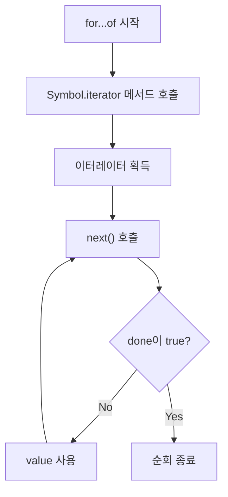
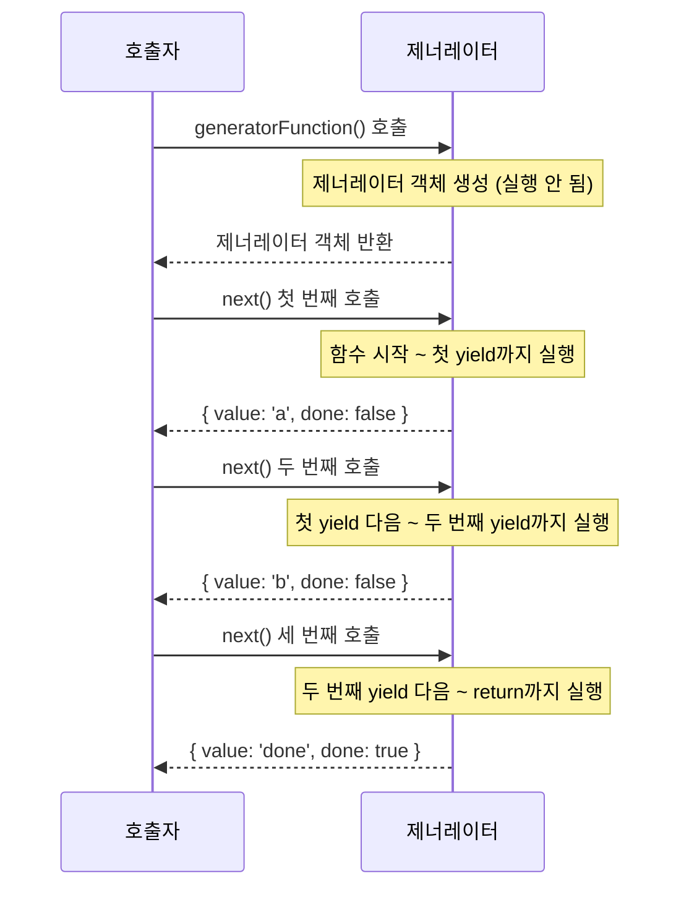

## 개요

JavaScript에서 `for...of` 문으로 배열을 순회할 때 내부적으로 어떤 일이 일어날까요? 왜 어떤 객체는 `for...of`로 순회할 수 있고, 어떤 객체는 할 수 없을까요? 그 답은 **이터레이션 프로토콜(Iteration Protocol)**에 있습니다.

**제너레이터(Generator)**는 이터레이터를 쉽게 만들 수 있는 특별한 함수입니다. 함수 실행을 중간에 멈추고, 필요할 때 다시 시작할 수 있는 독특한 능력을 가지고 있습니다. 이를 통해 지연 평가, 무한 시퀀스, 비동기 제어 흐름 등 강력한 패턴을 구현할 수 있습니다.

이 글에서는 이터레이션 프로토콜의 내부 동작 원리부터 제너레이터의 실전 활용까지 깊이 있게 다룹니다.

### 학습 목표

- 이터러블(Iterable)과 이터레이터(Iterator) 프로토콜의 정확한 이해
- Symbol.iterator의 역할과 커스텀 이터러블 구현 방법
- 제너레이터 함수의 실행 모델 (일시 정지/재개)
- yield와 yield*의 차이 및 활용법
- 지연 평가(Lazy Evaluation) 패턴 습득
- async 제너레이터를 활용한 비동기 데이터 스트림 처리

### 사전 지식

- JavaScript 함수 기초 ([JavaScript 함수 완벽 가이드](/posts/javascript-function-guide/) 참고)
- ES6+ 문법 기초
- 기본적인 반복문 이해 ([JavaScript 반복문 완벽 가이드](/posts/javascript-loops/) 참고)
- Promise와 async/await 기초 ([JavaScript Promise와 async/await 완벽 가이드](/posts/javascript-promise-async-await-guide/) 참고) - async 제너레이터 섹션 학습 시 필요

---

## 이터레이션 프로토콜 이해하기

### 이터레이션 프로토콜이란?

**이터레이션 프로토콜(Iteration Protocol)**은 ES6에서 도입된 규약으로, 데이터 컬렉션을 순회하기 위한 표준화된 방법을 정의합니다. 이 프로토콜은 두 가지로 구성됩니다:

| 프로토콜 | 설명 | 핵심 요구사항 |
|----------|------|---------------|
| **Iterable Protocol** | 객체가 순회 가능함을 나타냄 | `Symbol.iterator` 메서드 구현 |
| **Iterator Protocol** | 값을 순차적으로 생성하는 방법 정의 | `next()` 메서드 구현 |

### Iterable Protocol (이터러블 프로토콜)

**이터러블(Iterable)**은 `Symbol.iterator` 메서드를 가진 객체입니다. 이 메서드는 **이터레이터(Iterator)**를 반환해야 합니다.

```javascript
// 이터러블 객체의 구조
const iterable = {
  [Symbol.iterator]() {
    // 이터레이터를 반환
    return {
      next() {
        return { value: any, done: boolean };
      }
    };
  }
};
```

### Iterator Protocol (이터레이터 프로토콜)

**이터레이터(Iterator)**는 `next()` 메서드를 가진 객체입니다. `next()`를 호출할 때마다 다음 값을 반환합니다.

**next() 반환 객체:**

| 프로퍼티 | 타입 | 설명 |
|----------|------|------|
| `value` | any | 현재 순회 값 |
| `done` | boolean | 순회 완료 여부 (`true`면 종료) |

```javascript
// 이터레이터 직접 사용하기
const array = [1, 2, 3];
const iterator = array[Symbol.iterator](); // 이터레이터 얻기

console.log(iterator.next()); // { value: 1, done: false }
console.log(iterator.next()); // { value: 2, done: false }
console.log(iterator.next()); // { value: 3, done: false }
console.log(iterator.next()); // { value: undefined, done: true }
```

### for...of의 내부 동작

`for...of` 문은 이터레이션 프로토콜을 기반으로 동작합니다. 내부적으로 다음과 같은 과정을 거칩니다:

```javascript
const arr = ['a', 'b', 'c'];

// for...of 문
for (const item of arr) {
  console.log(item);
}

// 위 코드는 내부적으로 아래와 같이 동작합니다
const iterator = arr[Symbol.iterator]();
let result = iterator.next();

while (!result.done) {
  const item = result.value;
  console.log(item);
  result = iterator.next();
}
```

**for...of 동작 흐름:**



---

## 내장 이터러블

JavaScript에는 기본적으로 이터러블인 내장 객체들이 있습니다.

### 내장 이터러블 목록

| 객체 | 순회 대상 | 예시 |
|------|-----------|------|
| **Array** | 요소 | `[1, 2, 3]` |
| **String** | 문자 | `'hello'` |
| **Map** | [key, value] 쌍 | `new Map([['a', 1]])` |
| **Set** | 값 | `new Set([1, 2, 3])` |
| **TypedArray** | 요소 | `new Uint8Array([1, 2])` |
| **arguments** | 인수 | 함수 내 `arguments` |
| **NodeList** | DOM 노드 | `document.querySelectorAll()` |

### 내장 이터러블 사용 예시

```javascript
// String 이터레이터
const str = '안녕';
for (const char of str) {
  console.log(char); // '안', '녕'
}

// Map 이터레이터
const map = new Map([
  ['name', '홍길동'],
  ['age', 30]
]);
for (const [key, value] of map) {
  console.log(`${key}: ${value}`);
}
// 'name: 홍길동'
// 'age: 30'

// Set 이터레이터
const set = new Set([1, 2, 3, 2, 1]);
for (const value of set) {
  console.log(value); // 1, 2, 3 (중복 제거됨)
}
```

### 이터러블을 활용하는 문법들

이터러블은 `for...of` 외에도 다양한 문법에서 활용됩니다:

```javascript
const arr = [1, 2, 3];

// 1. 스프레드 연산자
const copy = [...arr];
console.log(copy); // [1, 2, 3]

// 2. 구조 분해 할당
const [first, second] = arr;
console.log(first, second); // 1 2

// 3. Array.from()
const arrayFromString = Array.from('abc');
console.log(arrayFromString); // ['a', 'b', 'c']

// 4. Promise.all(), Promise.race()
const promises = [Promise.resolve(1), Promise.resolve(2)];
Promise.all(promises).then(console.log); // [1, 2]

// 5. Map, Set 생성자
const mapFromArray = new Map([['a', 1], ['b', 2]]);
const setFromArray = new Set([1, 2, 3]);
```

### 이터러블이 아닌 객체

일반 객체는 기본적으로 이터러블이 아닙니다:

```javascript
const obj = { a: 1, b: 2, c: 3 };

// TypeError: obj is not iterable
// for (const item of obj) { }

// 객체를 순회하려면 Object 메서드 사용
for (const key of Object.keys(obj)) {
  console.log(key); // 'a', 'b', 'c'
}

for (const value of Object.values(obj)) {
  console.log(value); // 1, 2, 3
}

for (const [key, value] of Object.entries(obj)) {
  console.log(`${key}: ${value}`);
}
```

---

## 커스텀 이터러블 구현

### 기본 커스텀 이터러블

`Symbol.iterator` 메서드를 구현하면 어떤 객체든 이터러블로 만들 수 있습니다.

```javascript
// Range 이터러블 구현
const range = {
  from: 1,
  to: 5,

  [Symbol.iterator]() {
    let current = this.from;
    const last = this.to;

    return {
      next() {
        if (current <= last) {
          return { value: current++, done: false };
        }
        return { value: undefined, done: true };
      }
    };
  }
};

// 사용
for (const num of range) {
  console.log(num); // 1, 2, 3, 4, 5
}

// 스프레드 연산자도 사용 가능
console.log([...range]); // [1, 2, 3, 4, 5]
```

### 재사용 가능한 Range 클래스

```javascript
class Range {
  constructor(start, end, step = 1) {
    this.start = start;
    this.end = end;
    this.step = step;
  }

  [Symbol.iterator]() {
    let current = this.start;
    const end = this.end;
    const step = this.step;

    return {
      next() {
        if ((step > 0 && current <= end) || (step < 0 && current >= end)) {
          const value = current;
          current += step;
          return { value, done: false };
        }
        return { value: undefined, done: true };
      }
    };
  }
}

// 사용 예시
const range1to10 = new Range(1, 10, 2);
console.log([...range1to10]); // [1, 3, 5, 7, 9]

const countdown = new Range(5, 1, -1);
console.log([...countdown]); // [5, 4, 3, 2, 1]
```

### 연결 리스트 이터러블

```javascript
class Node {
  constructor(value) {
    this.value = value;
    this.next = null;
  }
}

class LinkedList {
  constructor() {
    this.head = null;
    this.tail = null;
  }

  append(value) {
    const node = new Node(value);
    if (!this.head) {
      this.head = node;
      this.tail = node;
    } else {
      this.tail.next = node;
      this.tail = node;
    }
    return this;
  }

  // 이터러블 프로토콜 구현
  [Symbol.iterator]() {
    let current = this.head;

    return {
      next() {
        if (current) {
          const value = current.value;
          current = current.next;
          return { value, done: false };
        }
        return { value: undefined, done: true };
      }
    };
  }
}

// 사용
const list = new LinkedList();
list.append(1).append(2).append(3);

for (const value of list) {
  console.log(value); // 1, 2, 3
}

console.log([...list]); // [1, 2, 3]
```

### 무한 이터러블

이터러블은 무한한 시퀀스도 표현할 수 있습니다:

```javascript
const infiniteNumbers = {
  [Symbol.iterator]() {
    let n = 0;
    return {
      next() {
        return { value: n++, done: false }; // 절대 done: true가 되지 않음
      }
    };
  }
};

// 주의: for...of로 직접 순회하면 무한 루프!
// 대신 필요한 만큼만 가져오기
const iterator = infiniteNumbers[Symbol.iterator]();
console.log(iterator.next().value); // 0
console.log(iterator.next().value); // 1
console.log(iterator.next().value); // 2
```

> 무한 이터러블을 `for...of`로 순회하면 무한 루프에 빠집니다. `break`문을 사용하거나 필요한 개수만 가져오는 방식으로 사용해야 합니다.
{: .prompt-warning }

---

## 제너레이터 기초

### 제너레이터란?

**제너레이터(Generator)**는 이터레이터를 생성하는 특별한 함수입니다. `function*` 키워드로 정의하며, 함수 실행을 중간에 멈추고(`yield`) 나중에 다시 시작할 수 있습니다.

```javascript
function* generatorFunction() {
  yield 1;
  yield 2;
  yield 3;
}

// 제너레이터 함수를 호출하면 제너레이터 객체(이터레이터)가 반환됨
const generator = generatorFunction();

console.log(generator.next()); // { value: 1, done: false }
console.log(generator.next()); // { value: 2, done: false }
console.log(generator.next()); // { value: 3, done: false }
console.log(generator.next()); // { value: undefined, done: true }
```

### 제너레이터의 특징

| 특징 | 설명 |
|------|------|
| **지연 실행** | `next()` 호출 전까지 코드가 실행되지 않음 |
| **실행 일시 정지** | `yield`에서 실행이 멈추고 제어권을 반환 |
| **상태 유지** | 다음 `next()` 호출 시 멈춘 지점부터 재개 |
| **이터러블** | 자동으로 이터러블 프로토콜을 구현 |

### 제너레이터 함수의 실행 흐름

```javascript
function* example() {
  console.log('시작');
  yield 'a';
  console.log('첫 번째 yield 후');
  yield 'b';
  console.log('두 번째 yield 후');
  return 'done';
}

const gen = example();
console.log('제너레이터 생성'); // 아직 '시작'이 출력되지 않음

console.log(gen.next());
// '시작' 출력
// { value: 'a', done: false }

console.log(gen.next());
// '첫 번째 yield 후' 출력
// { value: 'b', done: false }

console.log(gen.next());
// '두 번째 yield 후' 출력
// { value: 'done', done: true }
```

**실행 흐름 다이어그램:**



### yield 키워드

`yield`는 제너레이터 함수 내에서만 사용할 수 있는 키워드입니다. `yield` 표현식을 만나면:

1. 현재 값을 반환하고
2. 실행을 일시 정지합니다

```javascript
function* counter() {
  let count = 0;
  while (true) {
    yield count++;
  }
}

const c = counter();
console.log(c.next().value); // 0
console.log(c.next().value); // 1
console.log(c.next().value); // 2
// 무한히 계속 가능
```

### 제너레이터는 이터러블

제너레이터 객체는 이터러블이므로 `for...of`와 스프레드 연산자를 사용할 수 있습니다:

```javascript
function* fruits() {
  yield '사과';
  yield '바나나';
  yield '오렌지';
}

// for...of 사용
for (const fruit of fruits()) {
  console.log(fruit);
}
// '사과', '바나나', '오렌지'

// 스프레드 연산자 사용
console.log([...fruits()]); // ['사과', '바나나', '오렌지']
```

---

## 제너레이터의 양방향 통신

### next()에 값 전달하기

`next()` 메서드에 인수를 전달하면, 그 값이 `yield` 표현식의 반환값이 됩니다. 이를 통해 제너레이터와 양방향으로 통신할 수 있습니다.

```javascript
function* conversation() {
  const name = yield '이름이 뭐에요?';
  const hobby = yield `${name}님, 취미가 뭐에요?`;
  yield `${name}님의 취미는 ${hobby}이군요!`;
}

const talk = conversation();

console.log(talk.next().value);        // '이름이 뭐에요?'
console.log(talk.next('홍길동').value); // '홍길동님, 취미가 뭐에요?'
console.log(talk.next('코딩').value);   // '홍길동님의 취미는 코딩이군요!'
```

**동작 원리:**

1. 첫 번째 `next()`: `yield '이름이 뭐에요?'`까지 실행, `'이름이 뭐에요?'` 반환
2. 두 번째 `next('홍길동')`: `'홍길동'`이 `yield` 표현식의 결과가 되어 `name`에 할당
3. 세 번째 `next('코딩')`: `'코딩'`이 두 번째 `yield` 표현식의 결과가 되어 `hobby`에 할당

> 첫 번째 `next()` 호출 시 전달한 인수는 무시됩니다. 첫 `next()`는 제너레이터를 시작하는 역할이므로 값을 받을 `yield`가 없기 때문입니다.
{: .prompt-info }

### return() 메서드

`return()` 메서드는 제너레이터를 즉시 종료시킵니다:

```javascript
function* numbers() {
  yield 1;
  yield 2;
  yield 3;
}

const gen = numbers();
console.log(gen.next());      // { value: 1, done: false }
console.log(gen.return(100)); // { value: 100, done: true }
console.log(gen.next());      // { value: undefined, done: true }
```

### throw() 메서드

`throw()` 메서드는 제너레이터 내부에 에러를 던집니다:

```javascript
function* errorHandling() {
  try {
    yield 1;
    yield 2;
  } catch (error) {
    console.log('에러 잡힘:', error.message);
    yield '에러 처리됨';
  }
  yield 3;
}

const gen = errorHandling();
console.log(gen.next());                    // { value: 1, done: false }
console.log(gen.throw(new Error('테스트'))); // '에러 잡힘: 테스트', { value: '에러 처리됨', done: false }
console.log(gen.next());                    // { value: 3, done: false }
```

---

## 제너레이터 심화

### yield* - 제너레이터 위임

`yield*`는 다른 이터러블이나 제너레이터에게 위임합니다. 중첩된 이터러블을 평탄화하거나 제너레이터를 조합할 때 유용합니다.

```javascript
function* inner() {
  yield 'a';
  yield 'b';
}

function* outer() {
  yield 1;
  yield* inner(); // inner 제너레이터에 위임
  yield 2;
}

console.log([...outer()]); // [1, 'a', 'b', 2]
```

### yield*로 배열 평탄화

```javascript
function* flatten(arr) {
  for (const item of arr) {
    if (Array.isArray(item)) {
      yield* flatten(item); // 재귀적으로 위임
    } else {
      yield item;
    }
  }
}

const nested = [1, [2, [3, 4]], 5];
console.log([...flatten(nested)]); // [1, 2, 3, 4, 5]
```

### yield*의 반환값

`yield*`는 위임된 제너레이터의 return 값을 반환합니다:

```javascript
function* delegated() {
  yield 1;
  yield 2;
  return '완료';
}

function* delegating() {
  const result = yield* delegated();
  console.log('위임 결과:', result);
  yield 3;
}

const gen = delegating();
console.log(gen.next()); // { value: 1, done: false }
console.log(gen.next()); // { value: 2, done: false }
console.log(gen.next()); // '위임 결과: 완료', { value: 3, done: false }
```

### 제너레이터로 커스텀 이터러블 간단히 만들기

앞서 `Symbol.iterator`를 직접 구현했던 코드를 제너레이터로 훨씬 간단하게 만들 수 있습니다:

```javascript
// 제너레이터 없이 구현한 Range
const rangeWithoutGenerator = {
  from: 1,
  to: 5,
  [Symbol.iterator]() {
    let current = this.from;
    const last = this.to;
    return {
      next() {
        if (current <= last) {
          return { value: current++, done: false };
        }
        return { value: undefined, done: true };
      }
    };
  }
};

// 제너레이터로 구현한 Range (훨씬 간단!)
const rangeWithGenerator = {
  from: 1,
  to: 5,
  *[Symbol.iterator]() {
    for (let i = this.from; i <= this.to; i++) {
      yield i;
    }
  }
};

console.log([...rangeWithGenerator]); // [1, 2, 3, 4, 5]
```

---

## 지연 평가(Lazy Evaluation)

### 지연 평가란?

**지연 평가(Lazy Evaluation)**는 값이 실제로 필요할 때까지 계산을 미루는 전략입니다. 제너레이터는 이를 자연스럽게 구현할 수 있습니다.

### 즉시 평가 vs 지연 평가

```javascript
// 즉시 평가: 모든 값을 미리 계산
function getNumbersEager(n) {
  const result = [];
  for (let i = 0; i < n; i++) {
    console.log(`계산 중: ${i}`);
    result.push(i * 2);
  }
  return result;
}

// 지연 평가: 필요할 때만 계산
function* getNumbersLazy(n) {
  for (let i = 0; i < n; i++) {
    console.log(`계산 중: ${i}`);
    yield i * 2;
  }
}

// 즉시 평가 - 모든 값 즉시 계산
console.log('--- 즉시 평가 ---');
const eager = getNumbersEager(5);
console.log('배열 생성 완료');
console.log(eager[0]); // 이미 계산되어 있음

// 지연 평가 - 필요할 때 계산
console.log('--- 지연 평가 ---');
const lazy = getNumbersLazy(5);
console.log('제너레이터 생성 완료'); // 아직 아무것도 계산 안 됨
console.log(lazy.next().value); // 이때 첫 번째 값 계산
console.log(lazy.next().value); // 이때 두 번째 값 계산
```

### 무한 시퀀스 다루기

지연 평가의 가장 큰 장점은 무한한 시퀀스를 표현할 수 있다는 것입니다:

```javascript
// 무한 피보나치 수열
function* fibonacci() {
  let prev = 0;
  let curr = 1;

  while (true) {
    yield curr;
    [prev, curr] = [curr, prev + curr];
  }
}

// 필요한 만큼만 가져오기
const fib = fibonacci();
const first10 = [];
for (let i = 0; i < 10; i++) {
  first10.push(fib.next().value);
}
console.log(first10); // [1, 1, 2, 3, 5, 8, 13, 21, 34, 55]
```

### 지연 평가 유틸리티 함수들

```javascript
// take: n개만 가져오기
function* take(n, iterable) {
  let count = 0;
  for (const item of iterable) {
    if (count >= n) return;
    yield item;
    count++;
  }
}

// map: 변환 적용
function* map(fn, iterable) {
  for (const item of iterable) {
    yield fn(item);
  }
}

// filter: 조건에 맞는 것만
function* filter(predicate, iterable) {
  for (const item of iterable) {
    if (predicate(item)) {
      yield item;
    }
  }
}

// 조합해서 사용
function* naturals() {
  let n = 1;
  while (true) yield n++;
}

// 자연수 중 짝수만 골라서 제곱하고 처음 5개 가져오기
const result = take(5,
  map(x => x * x,
    filter(x => x % 2 === 0,
      naturals()
    )
  )
);

console.log([...result]); // [4, 16, 36, 64, 100]
```

### 메모리 효율성

지연 평가는 큰 데이터셋을 처리할 때 메모리 효율적입니다:

```javascript
// 메모리 비효율: 전체 배열을 메모리에 로드
function processEager(data) {
  return data
    .map(x => x * 2)      // 새 배열 생성
    .filter(x => x > 10)  // 또 새 배열 생성
    .slice(0, 5);         // 또 새 배열 생성
}

// 메모리 효율: 한 번에 하나씩 처리
function* processLazy(data) {
  let count = 0;
  for (const x of data) {
    const doubled = x * 2;
    if (doubled > 10) {
      yield doubled;
      count++;
      if (count >= 5) return;
    }
  }
}

// 큰 배열에서는 지연 평가가 훨씬 효율적
const largeArray = Array.from({ length: 1000000 }, (_, i) => i);
console.log([...processLazy(largeArray)]); // [12, 14, 16, 18, 20]
```

---

## 실전 활용 패턴

### 1. 고유 ID 생성기

```javascript
function* idGenerator(prefix = '') {
  let id = 0;
  while (true) {
    yield `${prefix}${++id}`;
  }
}

const userId = idGenerator('user_');
const postId = idGenerator('post_');

console.log(userId.next().value); // 'user_1'
console.log(userId.next().value); // 'user_2'
console.log(postId.next().value); // 'post_1'
console.log(userId.next().value); // 'user_3'
```

### 2. 상태 머신

제너레이터는 상태 머신을 구현하기에 이상적입니다:

```javascript
function* trafficLight() {
  while (true) {
    yield '녹색';
    yield '노란색';
    yield '빨간색';
  }
}

const light = trafficLight();
console.log(light.next().value); // '녹색'
console.log(light.next().value); // '노란색'
console.log(light.next().value); // '빨간색'
console.log(light.next().value); // '녹색' (다시 시작)
```

### 복잡한 상태 머신 예시

```javascript
function* orderStateMachine() {
  let state = 'pending';

  while (true) {
    const action = yield state;

    switch (state) {
      case 'pending':
        if (action === 'confirm') state = 'confirmed';
        else if (action === 'cancel') state = 'cancelled';
        break;
      case 'confirmed':
        if (action === 'ship') state = 'shipped';
        else if (action === 'cancel') state = 'cancelled';
        break;
      case 'shipped':
        if (action === 'deliver') state = 'delivered';
        break;
      case 'cancelled':
      case 'delivered':
        // 최종 상태, 변경 불가
        break;
    }
  }
}

const order = orderStateMachine();
console.log(order.next().value);          // 'pending'
console.log(order.next('confirm').value); // 'confirmed'
console.log(order.next('ship').value);    // 'shipped'
console.log(order.next('deliver').value); // 'delivered'
console.log(order.next('cancel').value);  // 'delivered' (변경 불가)
```

### 3. 페이지네이션

```javascript
function* paginate(items, pageSize) {
  for (let i = 0; i < items.length; i += pageSize) {
    yield items.slice(i, i + pageSize);
  }
}

const allItems = [1, 2, 3, 4, 5, 6, 7, 8, 9, 10];
const pages = paginate(allItems, 3);

console.log(pages.next().value); // [1, 2, 3]
console.log(pages.next().value); // [4, 5, 6]
console.log(pages.next().value); // [7, 8, 9]
console.log(pages.next().value); // [10]
```

### 4. 트리 순회

```javascript
class TreeNode {
  constructor(value, children = []) {
    this.value = value;
    this.children = children;
  }

  // 깊이 우선 순회 (DFS)
  *[Symbol.iterator]() {
    yield this.value;
    for (const child of this.children) {
      yield* child;
    }
  }

  // 너비 우선 순회 (BFS)
  *bfs() {
    const queue = [this];
    while (queue.length > 0) {
      const node = queue.shift();
      yield node.value;
      queue.push(...node.children);
    }
  }
}

// 트리 구조
//       1
//      /|\
//     2 3 4
//    /|   |
//   5 6   7

const tree = new TreeNode(1, [
  new TreeNode(2, [
    new TreeNode(5),
    new TreeNode(6)
  ]),
  new TreeNode(3),
  new TreeNode(4, [
    new TreeNode(7)
  ])
]);

// DFS 순회
console.log([...tree]); // [1, 2, 5, 6, 3, 4, 7]

// BFS 순회
console.log([...tree.bfs()]); // [1, 2, 3, 4, 5, 6, 7]
```

### 5. 제너레이터 기반 비동기 패턴 (co 라이브러리 원리)

> 이 패턴은 `async/await`가 등장하기 전에 비동기 코드를 동기처럼 작성하기 위해 사용되었습니다. 현재는 `async/await`를 사용하지만, 원리를 이해하면 도움이 됩니다.
{: .prompt-info }

```javascript
// 간단한 co 구현
function co(generatorFn) {
  return new Promise((resolve, reject) => {
    const generator = generatorFn();

    function step(nextFn) {
      let result;
      try {
        result = nextFn();
      } catch (error) {
        return reject(error);
      }

      if (result.done) {
        return resolve(result.value);
      }

      // yield된 Promise가 완료되면 다음 단계 진행
      Promise.resolve(result.value)
        .then(value => step(() => generator.next(value)))
        .catch(error => step(() => generator.throw(error)));
    }

    step(() => generator.next());
  });
}

// 사용 예시
function delay(ms, value) {
  return new Promise(resolve => setTimeout(() => resolve(value), ms));
}

function* fetchData() {
  console.log('데이터 요청 시작...');
  const user = yield delay(100, { name: '홍길동' });
  console.log('사용자:', user);

  const posts = yield delay(100, ['포스트 1', '포스트 2']);
  console.log('포스트:', posts);

  return { user, posts };
}

co(fetchData).then(result => {
  console.log('최종 결과:', result);
});
```

이 패턴이 바로 `async/await`의 기반이 되었습니다. `async/await`는 이 패턴을 언어 레벨에서 지원하는 것입니다.

---

## Async 제너레이터 (ES2018)

### async function* 문법

ES2018에서는 **async 제너레이터**가 도입되었습니다. 비동기 작업을 yield할 수 있는 제너레이터입니다. 제너레이터의 실행이 일시 정지되고 재개되는 메커니즘은 JavaScript 엔진의 실행 컨텍스트 관리와 밀접한 관련이 있습니다. 이 원리에 대해 더 자세히 알고 싶다면 [JavaScript 실행 컨텍스트 완벽 가이드](/posts/javascript-execution-context-guide/)를 참고하세요.

```javascript
async function* asyncGenerator() {
  yield await Promise.resolve(1);
  yield await Promise.resolve(2);
  yield await Promise.resolve(3);
}

// async 제너레이터는 for await...of로 순회
(async () => {
  for await (const value of asyncGenerator()) {
    console.log(value); // 1, 2, 3
  }
})();
```

### for await...of 루프

`for await...of`는 비동기 이터러블을 순회하는 문법입니다:

```javascript
async function* fetchPages(urls) {
  for (const url of urls) {
    const response = await fetch(url);
    const data = await response.json();
    yield data;
  }
}

// 사용
(async () => {
  const urls = [
    'https://api.example.com/page/1',
    'https://api.example.com/page/2',
    'https://api.example.com/page/3'
  ];

  for await (const pageData of fetchPages(urls)) {
    console.log('페이지 데이터:', pageData);
  }
})();
```

### 실전 예시: 스트리밍 데이터 처리

```javascript
// 서버에서 청크 단위로 데이터를 받아오는 시뮬레이션
async function* streamData() {
  const chunks = ['청크1', '청크2', '청크3', '청크4', '청크5'];

  for (const chunk of chunks) {
    // 네트워크 지연 시뮬레이션
    await new Promise(resolve => setTimeout(resolve, 500));
    yield chunk;
  }
}

// 스트리밍 데이터 처리
(async () => {
  console.log('스트리밍 시작...');

  for await (const chunk of streamData()) {
    console.log('받은 데이터:', chunk);
  }

  console.log('스트리밍 완료');
})();
```

### 페이지네이션 API 처리

```javascript
async function* fetchAllUsers(baseUrl) {
  let page = 1;
  let hasMore = true;

  while (hasMore) {
    // API 호출 시뮬레이션
    const response = await new Promise(resolve => {
      setTimeout(() => {
        const users = page <= 3
          ? Array.from({ length: 10 }, (_, i) => ({
              id: (page - 1) * 10 + i + 1,
              name: `User ${(page - 1) * 10 + i + 1}`
            }))
          : [];
        resolve({
          data: users,
          hasNextPage: page < 3
        });
      }, 100);
    });

    for (const user of response.data) {
      yield user;
    }

    hasMore = response.hasNextPage;
    page++;
  }
}

// 사용
(async () => {
  const users = [];

  for await (const user of fetchAllUsers('https://api.example.com/users')) {
    users.push(user);
    console.log('가져온 사용자:', user.name);
  }

  console.log(`총 ${users.length}명의 사용자`);
})();
```

---

## 성능 고려사항 및 주의점

### 일반 반복문과의 성능 비교

제너레이터는 편리하지만, 단순 반복에서는 일반 `for` 문보다 느릴 수 있습니다:

```javascript
const SIZE = 1000000;

// 일반 for 문
console.time('for loop');
let sum1 = 0;
for (let i = 0; i < SIZE; i++) {
  sum1 += i;
}
console.timeEnd('for loop');

// 제너레이터
function* range(n) {
  for (let i = 0; i < n; i++) yield i;
}

console.time('generator');
let sum2 = 0;
for (const i of range(SIZE)) {
  sum2 += i;
}
console.timeEnd('generator');

// 결과 (환경에 따라 다름):
// for loop: ~5ms
// generator: ~25ms
```

### 언제 제너레이터를 사용해야 하는가?

| 상황 | 권장 |
|------|------|
| 단순 배열 순회 | `for...of` 또는 배열 메서드 |
| 무한 시퀀스 | 제너레이터 |
| 지연 평가가 필요할 때 | 제너레이터 |
| 복잡한 이터러블 구현 | 제너레이터 |
| 상태 머신 | 제너레이터 |
| 비동기 스트림 | async 제너레이터 |
| 성능이 최우선일 때 | 일반 for 문 |

### 메모리 누수 주의

제너레이터가 완료되지 않으면 내부 상태가 메모리에 유지됩니다:

```javascript
function* leakyGenerator() {
  const largeData = new Array(1000000).fill('data');
  while (true) {
    yield largeData[0];
  }
}

const gen = leakyGenerator();
gen.next(); // largeData가 메모리에 유지됨

// 사용 완료 후 명시적으로 종료
gen.return(); // 제너레이터 종료, largeData 해제 가능
```

### try...finally와 제너레이터

제너레이터에서 `finally` 블록은 정상 종료, `return()`, `throw()` 모두에서 실행됩니다:

```javascript
function* withCleanup() {
  try {
    yield 1;
    yield 2;
    yield 3;
  } finally {
    console.log('정리 작업 실행');
  }
}

const gen = withCleanup();
console.log(gen.next()); // { value: 1, done: false }
console.log(gen.return('끝')); // '정리 작업 실행', { value: '끝', done: true }
```

---

## 정리 및 요약

### 핵심 개념 요약

| 개념 | 설명 |
|------|------|
| **이터러블** | `Symbol.iterator` 메서드를 가진 객체 |
| **이터레이터** | `next()` 메서드로 값을 순차 반환하는 객체 |
| **제너레이터** | `function*`로 정의된 이터레이터 생성 함수 |
| **yield** | 값을 반환하고 실행을 일시 정지 |
| **yield*** | 다른 이터러블에 위임 |
| **지연 평가** | 필요할 때까지 계산을 미룸 |
| **async 제너레이터** | 비동기 값을 yield하는 제너레이터 |

### 제너레이터 사용 시점

1. **커스텀 이터러블 구현** - `Symbol.iterator`를 직접 구현하는 것보다 간단
2. **무한 시퀀스** - 메모리 효율적으로 무한 데이터 표현
3. **지연 평가** - 필요한 값만 계산하여 성능 최적화
4. **상태 머신** - 복잡한 상태 전이를 명확하게 표현
5. **비동기 스트림** - 순차적 비동기 데이터 처리

### 기억해야 할 핵심 원칙

1. **제너레이터 함수는 호출해도 즉시 실행되지 않는다** - 제너레이터 객체만 반환
2. **`next()` 호출마다 다음 `yield`까지만 실행된다**
3. **제너레이터는 양방향 통신이 가능하다** - `next()`에 값을 전달
4. **무한 제너레이터 사용 시 종료 조건을 명확히 한다**
5. **성능이 중요한 상황에서는 벤치마킹 후 선택한다**

---

## 참고 자료

- [MDN - Iteration protocols](https://developer.mozilla.org/ko/docs/Web/JavaScript/Reference/Iteration_protocols)
- [MDN - Generator](https://developer.mozilla.org/ko/docs/Web/JavaScript/Reference/Global_Objects/Generator)
- [MDN - function*](https://developer.mozilla.org/ko/docs/Web/JavaScript/Reference/Statements/function*)
- [MDN - for await...of](https://developer.mozilla.org/ko/docs/Web/JavaScript/Reference/Statements/for-await...of)
- [ECMAScript Specification - Iteration](https://tc39.es/ecma262/#sec-iteration)
- [JavaScript.info - 제너레이터](https://ko.javascript.info/generators)
- [Exploring JS - Generators](https://exploringjs.com/es6/ch_generators.html)
